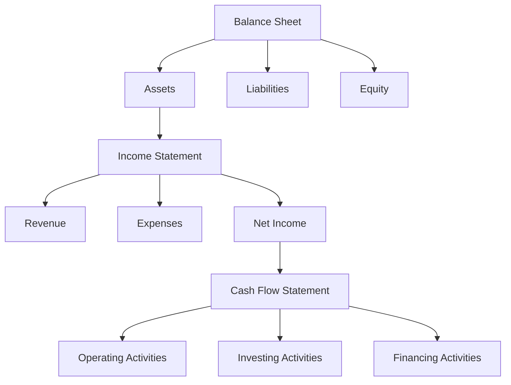

## 1.7 The Role of Financial Statements in Business Decision-Making

Financial statements are the backbone of any business's financial reporting process. They provide a structured representation of a company's financial performance and position, offering insights that are crucial for making informed business decisions. This section delves into how financial statements inform strategic decisions within a company, enhancing business performance and compliance.

### Understanding Financial Statements

Financial statements consist of three primary components: the balance sheet, the income statement, and the cash flow statement. Each of these plays a distinct role in business decision-making:

- **Balance Sheet**: Provides a snapshot of a company's financial position at a specific point in time, detailing assets, liabilities, and equity.
- **Income Statement**: Shows the company's financial performance over a period, highlighting revenue, expenses, and profits.
- **Cash Flow Statement**: Illustrates the inflows and outflows of cash, emphasizing the company's liquidity and financial flexibility.

### Strategic Decision-Making with Financial Statements

#### 1. Assessing Financial Health

Financial statements are pivotal in assessing a company's financial health. By analyzing these documents, stakeholders can determine the company's ability to generate profits, manage debts, and sustain operations. For instance, a strong balance sheet with a high level of assets compared to liabilities indicates financial stability, which is crucial for long-term strategic planning.

#### 2. Budgeting and Forecasting

Financial statements serve as a foundation for budgeting and forecasting. Historical financial data from income statements and cash flow statements enable businesses to predict future performance and allocate resources efficiently. Accurate forecasting helps in setting realistic financial goals and preparing for potential financial challenges.

#### 3. Investment Decisions

Investors rely on financial statements to make informed investment decisions. The income statement provides insights into profitability, while the balance sheet reveals the company's financial strength. Cash flow statements are particularly important for assessing the company's ability to generate cash, which is a key indicator of financial health and investment potential.

#### 4. Performance Evaluation

Management uses financial statements to evaluate the company's performance against its strategic objectives. By comparing financial metrics such as revenue growth, profit margins, and return on equity, management can identify areas of strength and weakness, enabling them to make data-driven decisions to improve performance.

#### 5. Risk Management

Financial statements play a crucial role in risk management by highlighting potential financial risks. For example, a high debt-to-equity ratio on the balance sheet may indicate financial leverage risk, prompting management to take corrective actions to mitigate potential financial distress.

### Practical Examples and Case Studies

#### Example 1: Expansion Decisions

Consider a Canadian manufacturing company planning to expand its operations. By analyzing its financial statements, the company can assess its current financial position, evaluate its ability to finance the expansion, and estimate the potential return on investment. The cash flow statement, in particular, helps determine whether the company has sufficient cash reserves to support the expansion without jeopardizing its financial stability.

#### Example 2: Cost Reduction Strategies

A retail business facing declining profits may use its income statement to identify areas where costs can be reduced. By analyzing expense categories, the company can implement cost-cutting measures, such as renegotiating supplier contracts or optimizing inventory levels, to improve profitability.

#### Case Study: Financial Turnaround

A case study of a struggling Canadian tech company illustrates the importance of financial statements in business decision-making. By conducting a thorough analysis of its financial statements, the company identified inefficiencies in its operations and implemented strategic changes, such as streamlining processes and focusing on high-margin products. These actions led to a successful financial turnaround, demonstrating the power of informed decision-making.

### Real-World Applications and Regulatory Scenarios

#### Compliance with Canadian Accounting Standards

In Canada, financial statements must comply with the International Financial Reporting Standards (IFRS) as adopted by the Canadian Accounting Standards Board (AcSB). Compliance ensures transparency and consistency in financial reporting, which is essential for maintaining investor confidence and meeting regulatory requirements.

#### Role of CPA Canada

CPA Canada provides guidance and resources to help businesses understand and apply accounting standards. By adhering to these standards, companies can ensure their financial statements accurately reflect their financial position and performance, facilitating better decision-making.

### Step-by-Step Guidance for Analyzing Financial Statements

1. **Review the Balance Sheet**: Start by examining the company's assets, liabilities, and equity. Look for trends in asset growth, changes in liabilities, and the overall equity position.

2. **Analyze the Income Statement**: Focus on revenue trends, cost of goods sold, and operating expenses. Calculate key metrics such as gross profit margin and net profit margin to assess profitability.

3. **Evaluate the Cash Flow Statement**: Examine cash flows from operating, investing, and financing activities. Assess the company's liquidity and ability to generate cash.

4. **Perform Ratio Analysis**: Use financial ratios to gain deeper insights into the company's performance. Key ratios include the current ratio, debt-to-equity ratio, and return on assets.

5. **Compare with Industry Benchmarks**: Benchmark the company's financial performance against industry peers to identify competitive strengths and weaknesses.

### Diagrams and Visuals

To enhance understanding, let's visualize the relationship between the three primary financial statements using a flowchart:

### Best Practices and Common Pitfalls

#### Best Practices

- **Regular Review**: Regularly review financial statements to stay informed about the company's financial position and performance.
- **Integrated Analysis**: Consider all three financial statements together for a comprehensive analysis.
- **Continuous Learning**: Stay updated with changes in accounting standards and industry trends to enhance decision-making capabilities.

#### Common Pitfalls

- **Overreliance on Historical Data**: While historical data is valuable, it's important to consider current market conditions and future trends.
- **Ignoring Cash Flow**: Focusing solely on profitability without considering cash flow can lead to financial mismanagement.
- **Neglecting Non-Financial Factors**: Financial statements provide quantitative data, but qualitative factors such as market conditions and competitive landscape are also crucial.

### Exam Strategies and Practical Tips

- **Focus on Key Metrics**: Understand key financial metrics and their implications for business decision-making.
- **Practice Ratio Analysis**: Practice calculating and interpreting financial ratios, as these are commonly tested in exams.
- **Understand Regulatory Requirements**: Familiarize yourself with Canadian accounting standards and compliance requirements.

### Summary

Financial statements are indispensable tools for business decision-making. They provide critical insights into a company's financial health, performance, and potential risks, enabling stakeholders to make informed strategic decisions. By understanding and effectively analyzing financial statements, businesses can enhance their decision-making processes, improve financial performance, and ensure compliance with regulatory standards.

### Additional Resources

- **CPA Canada**: Offers resources and guidance on Canadian accounting standards and financial reporting.
- **IFRS Foundation**: Provides information on International Financial Reporting Standards and their application.
- **Financial Accounting Standards Board (FASB)**: Offers resources on accounting standards and financial reporting.

---

## **Ready to Test Your Knowledge?**



### Financial statements are crucial for assessing a company's:

- [x] Financial health
- [ ] Marketing strategy
- [ ] Employee satisfaction
- [ ] Product design

> **Explanation:** Financial statements provide insights into a company's financial health, including its ability to generate profits and manage debts.

### Which financial statement provides a snapshot of a company's financial position at a specific point in time?

- [x] Balance Sheet
- [ ] Income Statement
- [ ] Cash Flow Statement
- [ ] Statement of Changes in Equity

> **Explanation:** The balance sheet provides a snapshot of a company's financial position, detailing assets, liabilities, and equity.

### Investors primarily use which financial statement to assess profitability?

- [ ] Balance Sheet
- [x] Income Statement
- [ ] Cash Flow Statement
- [ ] Statement of Changes in Equity

> **Explanation:** The income statement shows a company's financial performance over a period, highlighting revenue, expenses, and profits.

### What is a key indicator of a company's liquidity and financial flexibility?

- [ ] Revenue
- [ ] Net Income
- [x] Cash Flow
- [ ] Equity

> **Explanation:** The cash flow statement illustrates the inflows and outflows of cash, emphasizing the company's liquidity and financial flexibility.

### Which of the following is a common pitfall in financial statement analysis?

- [x] Overreliance on historical data
- [ ] Regular review of financial statements
- [ ] Integrated analysis of all statements
- [ ] Continuous learning

> **Explanation:** Overreliance on historical data can lead to overlooking current market conditions and future trends.

### What role does CPA Canada play in financial reporting?

- [x] Provides guidance and resources on accounting standards
- [ ] Designs marketing strategies
- [ ] Develops new financial products
- [ ] Manages company investments

> **Explanation:** CPA Canada provides guidance and resources to help businesses understand and apply accounting standards.

### Which financial statement is particularly important for assessing a company's ability to generate cash?

- [ ] Balance Sheet
- [ ] Income Statement
- [x] Cash Flow Statement
- [ ] Statement of Changes in Equity

> **Explanation:** The cash flow statement is crucial for assessing a company's ability to generate cash, a key indicator of financial health.

### What is a best practice when analyzing financial statements?

- [x] Regular review of financial statements
- [ ] Ignoring cash flow
- [ ] Overreliance on historical data
- [ ] Neglecting non-financial factors

> **Explanation:** Regularly reviewing financial statements helps stay informed about the company's financial position and performance.

### Which financial statement shows the company's financial performance over a period?

- [ ] Balance Sheet
- [x] Income Statement
- [ ] Cash Flow Statement
- [ ] Statement of Changes in Equity

> **Explanation:** The income statement shows the company's financial performance over a period, highlighting revenue, expenses, and profits.

### True or False: Financial statements are only useful for large corporations.

- [ ] True
- [x] False

> **Explanation:** Financial statements are useful for businesses of all sizes, providing critical insights into financial health and performance.


