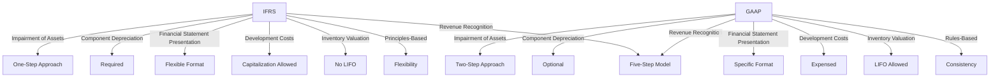

## 11.2 Comparing IFRS and GAAP

As you prepare for your Canadian Accounting Exams, understanding the differences between International Financial Reporting Standards (IFRS) and Generally Accepted Accounting Principles (GAAP) is crucial. These two accounting frameworks are the most widely used globally, and they significantly impact how financial statements are prepared and interpreted. This section will delve into the key differences between IFRS and GAAP, providing you with the knowledge needed to excel in your exams and future career.

### Introduction to IFRS and GAAP

**International Financial Reporting Standards (IFRS)** are a set of accounting standards developed by the International Accounting Standards Board (IASB). IFRS is used in over 140 countries, including Canada, and aims to provide a global framework for financial reporting that enhances comparability and transparency.

**Generally Accepted Accounting Principles (GAAP)**, on the other hand, are the accounting standards used in the United States. Developed by the Financial Accounting Standards Board (FASB), GAAP is known for its detailed and rule-based approach.

### Key Differences Between IFRS and GAAP

#### 1. Principles-Based vs. Rules-Based

One of the most fundamental differences between IFRS and GAAP is their underlying philosophy:

- **IFRS** is principles-based, which means it provides broad guidelines and relies on professional judgment to apply these principles to specific situations. This approach allows for flexibility and adaptability in financial reporting.

- **GAAP** is rules-based, providing detailed rules and guidelines for almost every accounting scenario. This approach aims to reduce ambiguity and ensure consistency in financial reporting.

#### 2. Revenue Recognition

Revenue recognition is a critical area where IFRS and GAAP differ:

- **IFRS** follows the five-step model outlined in IFRS 15, which focuses on the transfer of control of goods or services to the customer. This model emphasizes the satisfaction of performance obligations.

- **GAAP** also follows a similar five-step model under ASC 606, but there are differences in the application of these steps, particularly concerning the treatment of variable consideration and contract modifications.

#### 3. Inventory Valuation

Inventory valuation methods differ significantly between IFRS and GAAP:

- **IFRS** prohibits the use of the Last-In, First-Out (LIFO) method for inventory valuation. Companies must use either the First-In, First-Out (FIFO) or weighted-average cost method.

- **GAAP** allows the use of LIFO, FIFO, and weighted-average cost methods. This flexibility can lead to differences in reported inventory costs and net income.

#### 4. Development Costs

The treatment of development costs is another area of divergence:

- **IFRS** allows for the capitalization of development costs if certain criteria are met, such as technical feasibility and the intention to complete the asset for use or sale.

- **GAAP** generally requires that development costs be expensed as incurred, with limited exceptions for software development.

#### 5. Financial Statement Presentation

The presentation of financial statements varies between IFRS and GAAP:

- **IFRS** provides more flexibility in the presentation of financial statements. For example, IFRS does not prescribe a specific format for the income statement and allows for the presentation of expenses by function or nature.

- **GAAP** has more rigid requirements for financial statement presentation, including specific formats for the income statement and balance sheet.

#### 6. Component Depreciation

The approach to depreciation differs between the two frameworks:

- **IFRS** requires component depreciation, meaning that significant parts of an asset with different useful lives must be depreciated separately.

- **GAAP** allows for component depreciation but does not require it. Companies often use a single depreciation method for the entire asset.

#### 7. Impairment of Assets

The impairment of assets is another area where IFRS and GAAP diverge:

- **IFRS** uses a one-step approach for impairment testing, comparing the carrying amount of an asset to its recoverable amount (the higher of fair value less costs to sell and value in use).

- **GAAP** uses a two-step approach, first comparing the carrying amount to the undiscounted future cash flows. If the carrying amount exceeds the cash flows, the impairment loss is measured as the difference between the carrying amount and fair value.

### Practical Examples and Case Studies

To illustrate these differences, let's consider a practical example involving revenue recognition:

**Scenario:** A Canadian software company sells a software license with a one-year maintenance service. Under IFRS, the company would allocate the transaction price between the software license and the maintenance service based on their relative standalone selling prices. Revenue from the software license would be recognized at the point of sale, while revenue from the maintenance service would be recognized over the service period.

Under GAAP, the company would follow a similar allocation process, but differences may arise in the treatment of any discounts or variable consideration, potentially affecting the timing and amount of revenue recognized.

### Real-World Applications and Regulatory Scenarios

Understanding the differences between IFRS and GAAP is not only essential for exams but also for real-world applications. For instance, Canadian companies that operate in the U.S. or have U.S. investors must be aware of GAAP requirements to ensure compliance and effective communication with stakeholders.

Additionally, the convergence efforts between IFRS and GAAP have led to some harmonization, particularly in areas like revenue recognition and leases. However, significant differences remain, and professionals must stay informed about ongoing developments.

### Step-by-Step Guidance for Applying IFRS and GAAP

Applying IFRS and GAAP requires a thorough understanding of each framework's principles and rules. Here are some steps to help you navigate these standards:

1. **Identify the Relevant Standard:** Determine whether IFRS or GAAP applies to the transaction or event you are analyzing.

2. **Understand the Principles or Rules:** Familiarize yourself with the specific principles or rules outlined in the relevant standard.

3. **Apply Professional Judgment:** For IFRS, use professional judgment to interpret and apply the principles to the specific situation. For GAAP, ensure compliance with the detailed rules.

4. **Document Your Analysis:** Keep detailed records of your analysis and the rationale for your decisions, particularly when exercising professional judgment under IFRS.

5. **Stay Informed:** Keep up-to-date with changes and updates to IFRS and GAAP, as accounting standards are continually evolving.

### Diagrams and Charts

To enhance your understanding, let's use a **Mermaid.js diagram** to illustrate the key differences between IFRS and GAAP:

### Best Practices, Common Pitfalls, and Strategies

**Best Practices:**

- **Stay Informed:** Regularly update your knowledge of IFRS and GAAP through professional development and industry publications.

- **Use Professional Judgment Wisely:** When applying IFRS, ensure that your professional judgment is well-documented and based on sound reasoning.

- **Ensure Compliance:** For GAAP, meticulously follow the rules to avoid compliance issues.

**Common Pitfalls:**

- **Over-Reliance on Rules:** Under GAAP, avoid focusing solely on rules without considering the economic substance of transactions.

- **Inconsistent Application:** Ensure consistent application of principles and rules across similar transactions to maintain comparability.

**Strategies:**

- **Cross-Training:** Gain familiarity with both IFRS and GAAP to enhance your versatility and employability in the global market.

- **Leverage Technology:** Use accounting software and tools that support both IFRS and GAAP to streamline financial reporting.

### References and Additional Resources

- **CPA Canada:** Offers resources and guidance on IFRS and GAAP for Canadian accountants.
- **IASB and FASB Websites:** Provide access to the full text of IFRS and GAAP standards.
- **IFRS Foundation:** Offers educational materials and updates on IFRS developments.

### Summary

Understanding the differences between IFRS and GAAP is essential for accounting professionals, particularly those preparing for Canadian Accounting Exams. By mastering these differences, you will be better equipped to analyze financial statements, ensure compliance, and make informed business decisions.

### Ready to Test Your Knowledge?



### Which of the following is a principles-based accounting framework?

- [x] IFRS
- [ ] GAAP
- [ ] Both IFRS and GAAP
- [ ] Neither IFRS nor GAAP

> **Explanation:** IFRS is principles-based, providing broad guidelines and relying on professional judgment.

### Under which framework is LIFO inventory valuation prohibited?

- [x] IFRS
- [ ] GAAP
- [ ] Both IFRS and GAAP
- [ ] Neither IFRS nor GAAP

> **Explanation:** IFRS prohibits the use of LIFO, while GAAP allows it.

### How does IFRS treat development costs?

- [x] Allows capitalization if criteria are met
- [ ] Requires expensing as incurred
- [ ] Always capitalizes
- [ ] Never capitalizes

> **Explanation:** IFRS allows capitalization of development costs if certain criteria are met.

### What is the impairment approach under IFRS?

- [x] One-step approach
- [ ] Two-step approach
- [ ] Three-step approach
- [ ] No impairment testing

> **Explanation:** IFRS uses a one-step approach for impairment testing.

### Which framework requires component depreciation?

- [x] IFRS
- [ ] GAAP
- [ ] Both IFRS and GAAP
- [ ] Neither IFRS nor GAAP

> **Explanation:** IFRS requires component depreciation, while GAAP allows it but does not require it.

### What is the primary focus of IFRS 15?

- [x] Transfer of control
- [ ] Transfer of risk
- [ ] Transfer of ownership
- [ ] Transfer of liability

> **Explanation:** IFRS 15 focuses on the transfer of control of goods or services to the customer.

### Which framework is more flexible in financial statement presentation?

- [x] IFRS
- [ ] GAAP
- [ ] Both IFRS and GAAP
- [ ] Neither IFRS nor GAAP

> **Explanation:** IFRS provides more flexibility in the presentation of financial statements.

### How does GAAP treat revenue recognition?

- [x] Follows a five-step model
- [ ] Follows a four-step model
- [ ] Follows a three-step model
- [ ] Follows a two-step model

> **Explanation:** GAAP follows a five-step model for revenue recognition, similar to IFRS.

### Which framework is known for its detailed rules?

- [x] GAAP
- [ ] IFRS
- [ ] Both IFRS and GAAP
- [ ] Neither IFRS nor GAAP

> **Explanation:** GAAP is known for its detailed and rule-based approach.

### True or False: IFRS and GAAP have completely converged.

- [ ] True
- [x] False

> **Explanation:** While there have been convergence efforts, significant differences remain between IFRS and GAAP.


