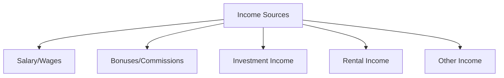
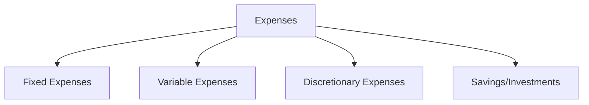

## 16.3 Developing a Personal Income Statement

### Introduction

Creating a personal income statement is a crucial step in managing your finances effectively. It provides a snapshot of your financial performance over a specific period, typically monthly or annually, by detailing your income sources and expenses. Understanding how to develop and interpret a personal income statement can empower you to make informed financial decisions, identify areas for improvement, and achieve your financial goals.

### Understanding the Personal Income Statement

A personal income statement is a financial document that summarizes your income and expenses. It is similar to a business income statement but tailored to individual or household finances. The primary purpose of this statement is to determine your net income, which is the difference between your total income and total expenses.

#### Components of a Personal Income Statement

1. **Income**: This section lists all sources of income, including:
   - **Salary/Wages**: Regular earnings from employment.
   - **Bonuses and Commissions**: Additional earnings based on performance.
   - **Investment Income**: Dividends, interest, and capital gains from investments.
   - **Rental Income**: Earnings from rental properties.
   - **Other Income**: Any other sources such as alimony, child support, or side hustles.

2. **Expenses**: This section categorizes all expenses, including:
   - **Fixed Expenses**: Regular, recurring expenses such as rent/mortgage, insurance, and loan payments.
   - **Variable Expenses**: Fluctuating expenses like groceries, utilities, and entertainment.
   - **Discretionary Expenses**: Non-essential spending on hobbies, dining out, and vacations.
   - **Savings and Investments**: Contributions to savings accounts, retirement funds, and other investments.

3. **Net Income**: Calculated as Total Income minus Total Expenses. A positive net income indicates a surplus, while a negative net income indicates a deficit.

### Steps to Develop a Personal Income Statement

#### Step 1: Gather Financial Information

Begin by collecting all relevant financial documents, such as pay stubs, bank statements, investment account statements, and bills. This information will help you accurately record your income and expenses.

#### Step 2: Record Your Income

List all sources of income, ensuring you include both regular and irregular income. Use gross income figures (before taxes) for a comprehensive view. Create a table to organize your income sources and amounts.

#### Step 3: Categorize and Record Expenses

Divide your expenses into fixed, variable, and discretionary categories. This will help you identify areas where you can cut costs if necessary. Use a spreadsheet or budgeting software to track these expenses consistently.

#### Step 4: Calculate Net Income

Subtract your total expenses from your total income to determine your net income. This figure will indicate whether you are living within your means or need to adjust your spending habits.

#### Step 5: Analyze and Adjust

Review your personal income statement to identify trends and areas for improvement. Consider setting financial goals, such as increasing savings or reducing debt, and create a plan to achieve them.

### Practical Example

Let's consider a practical example of developing a personal income statement for a fictional individual, Alex.

**Income:**
- Salary: $5,000/month
- Bonuses: $500/month
- Investment Income: $200/month
- Rental Income: $1,000/month

**Expenses:**
- Fixed Expenses: $2,500/month (Rent, Insurance, Loan Payments)
- Variable Expenses: $1,200/month (Groceries, Utilities, Transportation)
- Discretionary Expenses: $800/month (Dining Out, Entertainment)
- Savings/Investments: $700/month

**Net Income Calculation:**
- Total Income: $6,700
- Total Expenses: $5,200
- Net Income: $1,500 (Surplus)

In this example, Alex has a positive net income, indicating a surplus that can be allocated towards savings or investments.

### Best Practices for Developing a Personal Income Statement

1. **Consistency**: Regularly update your income statement to reflect changes in income or expenses.
2. **Accuracy**: Ensure all figures are accurate and up-to-date to provide a true reflection of your financial situation.
3. **Review and Adjust**: Periodically review your income statement to identify areas for improvement and adjust your budget accordingly.
4. **Use Technology**: Leverage budgeting apps or software to simplify tracking and analysis.

### Common Pitfalls and How to Avoid Them

1. **Overlooking Irregular Income**: Include all sources of income, even those that are irregular or infrequent.
2. **Underestimating Expenses**: Accurately categorize and track all expenses to avoid underestimating your spending.
3. **Ignoring Small Expenses**: Small, frequent expenses can add up; ensure they are accounted for in your statement.
4. **Failing to Review Regularly**: Regular reviews help you stay on track and make necessary adjustments.

### Real-World Applications

Developing a personal income statement is not only beneficial for personal financial management but also essential for various real-world applications, such as:

- **Loan Applications**: Lenders often require a personal income statement to assess your financial stability.
- **Financial Planning**: A detailed income statement aids in creating effective financial plans and setting realistic goals.
- **Investment Decisions**: Understanding your financial position helps in making informed investment choices.

### Regulatory Considerations

While personal income statements are not subject to the same regulatory standards as business financial statements, understanding Canadian accounting principles can enhance your financial literacy and decision-making.

### Conclusion

Developing a personal income statement is a fundamental aspect of personal financial management. By accurately tracking your income and expenses, you can gain valuable insights into your financial health, make informed decisions, and achieve your financial goals. Regularly updating and reviewing your income statement will ensure you remain on track and adapt to any changes in your financial situation.

## **Ready to Test Your Knowledge?**



### What is the primary purpose of a personal income statement?

- [x] To determine net income by summarizing income and expenses
- [ ] To calculate taxes owed
- [ ] To track only fixed expenses
- [ ] To list all assets and liabilities

> **Explanation:** The primary purpose of a personal income statement is to determine net income by summarizing all sources of income and expenses.

### Which of the following is considered a fixed expense?

- [x] Mortgage payment
- [ ] Dining out
- [ ] Groceries
- [ ] Entertainment

> **Explanation:** A mortgage payment is a fixed expense because it is a regular, recurring cost.

### What should be subtracted from total income to calculate net income?

- [x] Total expenses
- [ ] Total assets
- [ ] Total liabilities
- [ ] Total savings

> **Explanation:** Net income is calculated by subtracting total expenses from total income.

### Which category includes expenses like dining out and vacations?

- [x] Discretionary expenses
- [ ] Fixed expenses
- [ ] Variable expenses
- [ ] Savings

> **Explanation:** Discretionary expenses include non-essential spending such as dining out and vacations.

### What is a common mistake to avoid when developing a personal income statement?

- [x] Ignoring small, frequent expenses
- [ ] Overestimating income
- [ ] Including all sources of income
- [ ] Regularly reviewing the statement

> **Explanation:** Ignoring small, frequent expenses is a common mistake as they can add up significantly.

### How often should you update your personal income statement?

- [x] Regularly, to reflect changes in income or expenses
- [ ] Only once a year
- [ ] Every five years
- [ ] Never

> **Explanation:** Regular updates ensure the income statement accurately reflects your current financial situation.

### What is the benefit of using budgeting apps or software?

- [x] Simplifies tracking and analysis of income and expenses
- [ ] Eliminates the need for a budget
- [ ] Guarantees financial success
- [ ] Automatically increases income

> **Explanation:** Budgeting apps or software simplify the process of tracking and analyzing income and expenses.

### Why is it important to review your personal income statement periodically?

- [x] To identify areas for improvement and adjust your budget
- [ ] To increase your income automatically
- [ ] To avoid paying taxes
- [ ] To eliminate all expenses

> **Explanation:** Periodic reviews help identify areas for improvement and allow for necessary budget adjustments.

### What is a surplus in a personal income statement?

- [x] When total income exceeds total expenses
- [ ] When total expenses exceed total income
- [ ] When income equals expenses
- [ ] When expenses are not tracked

> **Explanation:** A surplus occurs when total income exceeds total expenses, indicating positive net income.

### True or False: A personal income statement is subject to the same regulatory standards as business financial statements.

- [ ] True
- [x] False

> **Explanation:** Personal income statements are not subject to the same regulatory standards as business financial statements.


