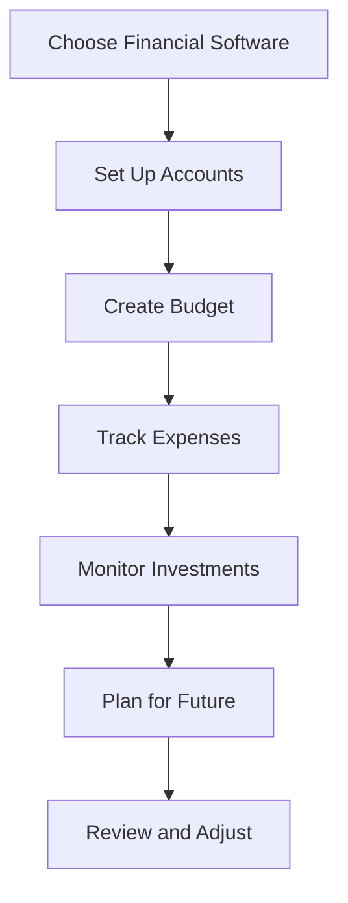

## 16.9 Personal Financial Software Tools

In today's fast-paced world, managing personal finances effectively is more crucial than ever. With the advent of technology, personal financial software tools have become indispensable for individuals seeking to gain control over their financial lives. These tools offer a range of functionalities, from budgeting and expense tracking to investment management and financial planning. This section will delve into the various types of personal financial software tools available, their features, benefits, and how they can be leveraged to enhance financial management. Additionally, we will explore practical examples, case studies, and scenarios relevant to the Canadian accounting profession, providing actionable insights and compliance considerations.

### Understanding Personal Financial Software Tools

Personal financial software tools are digital applications designed to assist individuals in managing their finances. These tools can be accessed via desktop, mobile, or web-based platforms, offering flexibility and convenience. They are equipped with features that help users track income and expenses, create budgets, monitor investments, and plan for future financial goals.

#### Key Features of Personal Financial Software Tools

1. **Budgeting and Expense Tracking**: Most financial software tools offer budgeting features that allow users to set spending limits for various categories such as groceries, entertainment, and utilities. Expense tracking helps users monitor their spending habits and identify areas where they can cut costs.

2. **Investment Tracking**: These tools provide insights into investment portfolios, including stocks, bonds, mutual funds, and retirement accounts. Users can track performance, analyze trends, and make informed decisions about their investments.

3. **Financial Planning**: Personal financial software tools often include features for setting financial goals, such as saving for a house, retirement, or education. They provide projections and scenarios to help users plan for the future.

4. **Bill Management**: Some tools offer bill management features, allowing users to schedule payments, receive reminders, and avoid late fees.

5. **Reporting and Analysis**: Comprehensive reporting features enable users to generate detailed financial reports, analyze spending patterns, and gain insights into their financial health.

6. **Security and Privacy**: Given the sensitive nature of financial data, these tools prioritize security and privacy, employing encryption and other measures to protect user information.

#### Types of Personal Financial Software Tools

1. **Desktop Software**: Traditional software installed on a computer, offering robust features and offline access. Examples include Quicken and Moneydance.

2. **Web-Based Applications**: Online platforms accessible through a web browser, providing real-time updates and synchronization across devices. Examples include Mint and Personal Capital.

3. **Mobile Apps**: Applications designed for smartphones and tablets, offering on-the-go access to financial data. Examples include YNAB (You Need A Budget) and PocketGuard.

4. **Hybrid Solutions**: A combination of desktop, web-based, and mobile functionalities, providing a seamless experience across all devices.

### Benefits of Using Personal Financial Software Tools

1. **Improved Financial Awareness**: By consolidating financial information in one place, these tools provide a comprehensive view of an individual's financial situation, enhancing awareness and understanding.

2. **Time Efficiency**: Automating tasks such as expense tracking and bill payments saves time and reduces the likelihood of errors.

3. **Informed Decision-Making**: Access to detailed reports and analyses enables users to make informed financial decisions, optimizing their financial strategies.

4. **Goal Achievement**: By setting and tracking financial goals, users can stay motivated and focused on achieving their objectives.

5. **Enhanced Security**: With advanced security features, users can manage their finances with confidence, knowing their data is protected.

### Practical Examples and Case Studies

#### Case Study: Budgeting with YNAB

YNAB (You Need A Budget) is a popular budgeting tool that emphasizes proactive financial management. A user in Canada, let's call them Alex, decided to use YNAB to gain control over their finances. By setting up a budget and categorizing expenses, Alex was able to identify unnecessary spending on dining out. Over six months, Alex reduced dining expenses by 30%, reallocating those funds towards a savings goal for a down payment on a house. This case study illustrates how budgeting tools can lead to significant financial improvements.

#### Scenario: Investment Tracking with Personal Capital

Personal Capital is a web-based tool that offers robust investment tracking features. Consider a Canadian investor, Jamie, who uses Personal Capital to monitor their diverse investment portfolio. By analyzing the performance of different assets and receiving personalized insights, Jamie was able to rebalance their portfolio, optimizing returns and reducing risk. This scenario highlights the importance of investment tracking tools in managing and growing wealth.

### Real-World Applications and Regulatory Scenarios

In the Canadian context, personal financial software tools must comply with regulations such as the Personal Information Protection and Electronic Documents Act (PIPEDA), which governs the collection, use, and disclosure of personal information. Users should ensure that the software they choose adheres to these regulations, providing transparency and control over their data.

### Step-by-Step Guidance for Using Personal Financial Software Tools

1. **Choosing the Right Tool**: Evaluate your financial needs and goals to select a tool that aligns with your requirements. Consider factors such as cost, features, and compatibility with your devices.

2. **Setting Up Accounts**: Once you've chosen a tool, set up your accounts by linking bank accounts, credit cards, and investment accounts. This will provide a comprehensive view of your financial situation.

3. **Creating a Budget**: Use the budgeting features to set spending limits for different categories. Regularly review and adjust your budget to reflect changes in your financial situation.

4. **Tracking Expenses**: Monitor your spending habits by categorizing expenses and identifying areas for improvement. Use reports and analyses to gain insights into your financial behavior.

5. **Monitoring Investments**: Keep track of your investment portfolio, analyzing performance and making adjustments as needed. Use the tool's insights to inform your investment decisions.

6. **Planning for the Future**: Set financial goals and use the tool's planning features to create scenarios and projections. Regularly review your progress and make adjustments to stay on track.

### Diagrams and Visuals

To enhance understanding, let's use a Mermaid.js diagram to illustrate the flow of personal financial management using software tools:

### Best Practices, Common Pitfalls, and Strategies

#### Best Practices

- **Regular Updates**: Keep your financial software updated to benefit from the latest features and security enhancements.
- **Consistent Monitoring**: Regularly review your financial data to stay informed and make timely adjustments.
- **Data Backup**: Ensure your financial data is backed up to prevent loss in case of technical issues.

#### Common Pitfalls

- **Over-Reliance on Automation**: While automation is beneficial, it's essential to review and verify data for accuracy.
- **Neglecting Security**: Always use strong passwords and enable two-factor authentication to protect your accounts.

#### Strategies for Success

- **Set Realistic Goals**: Establish achievable financial goals to maintain motivation and track progress effectively.
- **Educate Yourself**: Continuously learn about personal finance to make informed decisions and optimize your financial strategies.

### References to Canadian Accounting Standards and Additional Resources

For further exploration, consider the following resources:

- **CPA Canada**: Offers guidance and resources on financial management and accounting standards.
- **Financial Consumer Agency of Canada (FCAC)**: Provides information on managing personal finances and understanding financial products.
- **International Financial Reporting Standards (IFRS)**: Explore how these standards apply to personal financial management in Canada.

### Encouraging Application and Practice

To reinforce your understanding, apply the principles discussed by experimenting with different financial software tools. Consider setting up a mock budget or tracking a hypothetical investment portfolio to gain hands-on experience.

### Summary and Key Points

- Personal financial software tools offer a range of features to enhance financial management, including budgeting, investment tracking, and financial planning.
- These tools provide numerous benefits, such as improved financial awareness, time efficiency, and informed decision-making.
- When choosing a tool, consider your financial needs, goals, and regulatory compliance.
- Regular monitoring, data backup, and security measures are essential for effective financial management.

### Sample Exam-Style Questions

To test your knowledge, consider the following questions:

## **Ready to Test Your Knowledge?**



### Which of the following is a key feature of personal financial software tools?

- [x] Budgeting and Expense Tracking
- [ ] Tax Filing
- [ ] Legal Advice
- [ ] Real Estate Management

> **Explanation:** Budgeting and expense tracking are fundamental features of personal financial software tools, helping users manage their spending and financial goals.

### What is a common benefit of using personal financial software tools?

- [x] Improved Financial Awareness
- [ ] Guaranteed Investment Returns
- [ ] Automatic Tax Refunds
- [ ] Free Financial Advice

> **Explanation:** Personal financial software tools enhance financial awareness by providing a comprehensive view of an individual's financial situation.

### Which type of personal financial software tool offers on-the-go access?

- [x] Mobile Apps
- [ ] Desktop Software
- [ ] Web-Based Applications
- [ ] Hybrid Solutions

> **Explanation:** Mobile apps are designed for smartphones and tablets, offering users the convenience of accessing their financial data on-the-go.

### What should users consider when choosing a personal financial software tool?

- [x] Cost, Features, and Compatibility
- [ ] Brand Popularity
- [ ] Celebrity Endorsements
- [ ] Color Scheme

> **Explanation:** When selecting a personal financial software tool, users should evaluate factors such as cost, features, and compatibility with their devices.

### Which Canadian regulation governs the collection, use, and disclosure of personal information?

- [x] Personal Information Protection and Electronic Documents Act (PIPEDA)
- [ ] Canada Revenue Agency Act
- [ ] Canadian Securities Regulation
- [ ] Financial Consumer Agency Act

> **Explanation:** PIPEDA is the Canadian regulation that governs the handling of personal information, ensuring privacy and security.

### What is a common pitfall when using personal financial software tools?

- [x] Over-Reliance on Automation
- [ ] Manual Data Entry
- [ ] Frequent Software Updates
- [ ] Using Multiple Tools

> **Explanation:** Over-reliance on automation can lead to errors if users do not regularly review and verify their financial data.

### How can users protect their financial data when using software tools?

- [x] Use Strong Passwords and Enable Two-Factor Authentication
- [ ] Share Passwords with Trusted Friends
- [ ] Disable Security Features
- [ ] Use Public Wi-Fi Networks

> **Explanation:** Strong passwords and two-factor authentication are essential measures for protecting financial data.

### Which feature helps users set and track financial goals?

- [x] Financial Planning
- [ ] Bill Management
- [ ] Expense Tracking
- [ ] Investment Tracking

> **Explanation:** Financial planning features in software tools assist users in setting and tracking their financial goals.

### What is a strategy for successful financial management using software tools?

- [x] Set Realistic Goals
- [ ] Avoid Monitoring Financial Data
- [ ] Rely Solely on Automation
- [ ] Ignore Security Updates

> **Explanation:** Setting realistic goals helps maintain motivation and track progress effectively in financial management.

### True or False: Personal financial software tools guarantee investment returns.

- [ ] True
- [x] False

> **Explanation:** Personal financial software tools do not guarantee investment returns; they provide insights and tracking to inform investment decisions.


