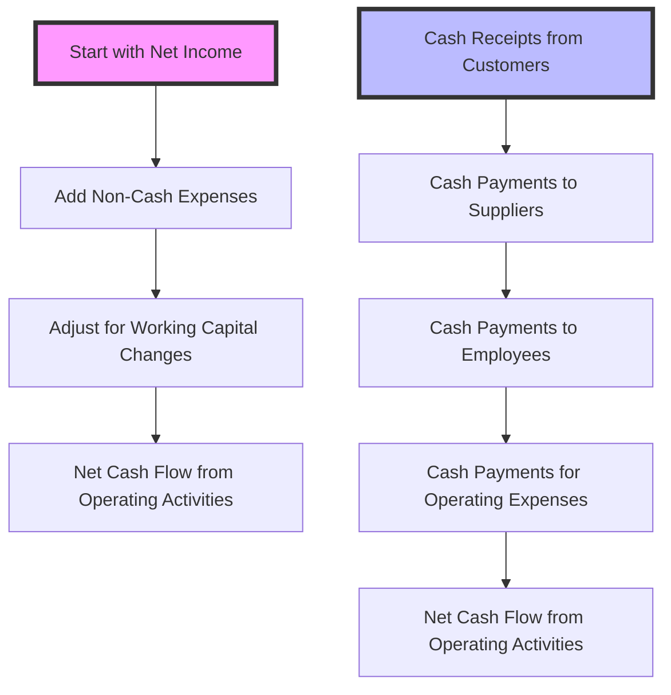

## 4.5 Direct vs. Indirect Method

The cash flow statement is a crucial component of a company's financial statements, providing insights into the cash inflows and outflows over a period. Understanding the direct and indirect methods of presenting operating cash flows is essential for interpreting these statements effectively. This section will delve into the differences between these methods, their applications, advantages, and implications, particularly in the context of Canadian accounting standards and exams.

### Introduction to Cash Flow Methods

The cash flow statement is divided into three main sections: operating activities, investing activities, and financing activities. The focus of this discussion is on the operating activities section, which can be presented using either the direct or indirect method. Both methods ultimately reconcile to the same net cash flow from operating activities, but they differ in presentation and the level of detail provided.

### The Direct Method

The direct method of presenting cash flows from operating activities involves listing all major operating cash receipts and payments. This method provides a clear view of cash transactions and is often considered more intuitive for users of financial statements.

#### Key Components of the Direct Method

1. **Cash Receipts from Customers:** This includes all cash received from customers for goods sold or services rendered.
2. **Cash Payments to Suppliers:** This covers cash paid for goods and services used in production.
3. **Cash Payments to Employees:** Salaries, wages, and other employee-related expenses paid in cash.
4. **Cash Payments for Operating Expenses:** Other operating expenses paid in cash, such as rent, utilities, and insurance.
5. **Cash Payments for Interest and Taxes:** Cash paid for interest and taxes, if applicable.

#### Advantages of the Direct Method

- **Clarity and Transparency:** Provides a straightforward view of cash flows, making it easier for users to understand the sources and uses of cash.
- **Enhanced Decision-Making:** Offers detailed information that can aid in cash management and forecasting.
- **Compliance with IFRS:** Under IFRS, the direct method is encouraged as it provides more useful information.

#### Challenges of the Direct Method

- **Data Collection:** Requires detailed tracking of cash transactions, which can be time-consuming and costly.
- **Less Commonly Used:** Despite its advantages, many companies prefer the indirect method due to its simplicity and alignment with accrual accounting.

### The Indirect Method

The indirect method starts with net income and adjusts for non-cash transactions, changes in working capital, and other items to arrive at net cash flow from operating activities. This method is more commonly used and aligns closely with the accrual basis of accounting.

#### Key Components of the Indirect Method

1. **Starting with Net Income:** The process begins with net income from the income statement.
2. **Adjustments for Non-Cash Items:** Add back non-cash expenses such as depreciation and amortization.
3. **Changes in Working Capital:** Adjust for changes in current assets and liabilities, such as accounts receivable, inventory, and accounts payable.
4. **Adjustments for Non-Operating Gains and Losses:** Remove gains or losses from investing and financing activities.

#### Advantages of the Indirect Method

- **Simplicity and Efficiency:** Easier to prepare as it uses information readily available from the income statement and balance sheet.
- **Widely Accepted:** Most companies use this method, making it familiar to users of financial statements.
- **Alignment with Accrual Accounting:** Reflects the accrual basis of accounting, which is the standard for financial reporting.

#### Challenges of the Indirect Method

- **Less Transparency:** Does not provide a direct view of cash receipts and payments, which can be less informative for cash management.
- **Complex Adjustments:** Requires careful adjustments to ensure accuracy, particularly in changes in working capital.

### Practical Examples and Case Studies

#### Example 1: Direct Method Cash Flow Statement

Consider a company, Maple Leaf Enterprises, which uses the direct method for its cash flow statement. The following is a simplified example:

- **Cash Receipts from Customers:** $500,000
- **Cash Payments to Suppliers:** $200,000
- **Cash Payments to Employees:** $150,000
- **Cash Payments for Operating Expenses:** $50,000
- **Cash Payments for Interest and Taxes:** $20,000

**Net Cash Flow from Operating Activities:** $80,000

#### Example 2: Indirect Method Cash Flow Statement

Using the same company, Maple Leaf Enterprises, the indirect method would start with net income and adjust for non-cash items and changes in working capital:

- **Net Income:** $100,000
- **Add Back Depreciation:** $10,000
- **Decrease in Accounts Receivable:** $5,000
- **Increase in Inventory:** ($10,000)
- **Increase in Accounts Payable:** $5,000

**Net Cash Flow from Operating Activities:** $80,000

### Regulatory Considerations and Standards

In Canada, companies must adhere to the International Financial Reporting Standards (IFRS) or the Accounting Standards for Private Enterprises (ASPE), depending on their classification. Both standards allow the use of either the direct or indirect method, but IFRS encourages the direct method for its clarity.

#### IFRS and the Direct Method

Under IFRS, the direct method is preferred as it provides more detailed information about cash flows. However, due to the complexity and cost of preparation, many companies still opt for the indirect method.

#### ASPE and Method Choice

ASPE, which applies to private enterprises in Canada, also permits both methods. The choice often depends on the company's resources and the needs of its financial statement users.

### Real-World Applications

Understanding the differences between the direct and indirect methods is crucial for accountants and financial analysts. The choice of method can impact how cash flow information is interpreted and used for decision-making.

- **Investment Analysis:** Investors may prefer the direct method for its transparency, allowing them to see the actual cash generated from operations.
- **Internal Management:** Companies may use the direct method internally for cash management and forecasting, even if they report externally using the indirect method.
- **Regulatory Reporting:** Companies must ensure compliance with applicable standards and may need to justify their choice of method to regulators or auditors.

### Step-by-Step Guidance for Preparation

#### Preparing a Direct Method Cash Flow Statement

1. **Gather Cash Transaction Data:** Collect detailed records of cash receipts and payments.
2. **Classify Cash Flows:** Organize cash flows into categories such as operating, investing, and financing activities.
3. **Prepare the Statement:** List cash flows from operating activities, followed by investing and financing activities.
4. **Reconcile with Cash Balance:** Ensure the net cash flow reconciles with the change in the cash balance on the balance sheet.

#### Preparing an Indirect Method Cash Flow Statement

1. **Start with Net Income:** Obtain net income from the income statement.
2. **Adjust for Non-Cash Items:** Add back non-cash expenses and adjust for gains or losses.
3. **Adjust for Working Capital Changes:** Analyze changes in current assets and liabilities.
4. **Prepare the Statement:** Summarize adjustments to arrive at net cash flow from operating activities.

### Diagrams and Visual Aids

To enhance understanding, the following Mermaid.js diagram illustrates the flow of preparing a cash flow statement using both methods:

### Best Practices and Common Pitfalls

- **Consistency:** Ensure consistency in the method used across reporting periods to facilitate comparison.
- **Accuracy in Adjustments:** Pay close attention to adjustments for non-cash items and working capital changes to avoid errors.
- **Clear Documentation:** Maintain clear records of cash transactions to support the preparation of the direct method statement.

### Exam Strategies and Tips

- **Understand Both Methods:** Be familiar with the preparation and interpretation of both methods, as exam questions may cover either.
- **Practice with Examples:** Work through practice problems to reinforce understanding and improve speed and accuracy.
- **Focus on Adjustments:** Pay special attention to the adjustments required in the indirect method, as these are commonly tested.

### Additional Resources and References

- **CPA Canada:** Explore resources and guidelines provided by CPA Canada for further insights into cash flow statement preparation.
- **IFRS and ASPE Standards:** Review relevant sections of the IFRS and ASPE standards for detailed guidance on cash flow reporting.
- **Practice Exams:** Utilize practice exams and study materials to test your knowledge and prepare for the exam.

## **Ready to Test Your Knowledge?**



### Which method provides a more detailed view of cash transactions?

- [x] Direct Method
- [ ] Indirect Method
- [ ] Both methods provide the same level of detail
- [ ] Neither method provides detailed cash transactions

> **Explanation:** The direct method provides a more detailed view of cash transactions by listing major cash receipts and payments.

### Which method starts with net income and adjusts for non-cash items?

- [ ] Direct Method
- [x] Indirect Method
- [ ] Both methods
- [ ] Neither method

> **Explanation:** The indirect method starts with net income and adjusts for non-cash items and changes in working capital.

### What is a common advantage of the indirect method?

- [ ] Provides more detailed cash transaction information
- [x] Easier to prepare using existing financial statements
- [ ] Encouraged by IFRS
- [ ] Requires detailed cash transaction tracking

> **Explanation:** The indirect method is easier to prepare as it uses information readily available from the income statement and balance sheet.

### Under which accounting standard is the direct method encouraged?

- [x] IFRS
- [ ] ASPE
- [ ] GAAP
- [ ] None of the above

> **Explanation:** Under IFRS, the direct method is encouraged as it provides more useful information about cash flows.

### Which method is more commonly used by companies?

- [ ] Direct Method
- [x] Indirect Method
- [ ] Both methods are equally used
- [ ] Neither method is commonly used

> **Explanation:** The indirect method is more commonly used by companies due to its simplicity and alignment with accrual accounting.

### What is the starting point for the indirect method?

- [ ] Cash Receipts from Customers
- [x] Net Income
- [ ] Cash Payments to Suppliers
- [ ] Cash Payments for Operating Expenses

> **Explanation:** The indirect method starts with net income from the income statement.

### Which method requires detailed tracking of cash transactions?

- [x] Direct Method
- [ ] Indirect Method
- [ ] Both methods
- [ ] Neither method

> **Explanation:** The direct method requires detailed tracking of cash transactions to list major cash receipts and payments.

### What is a key component of the direct method?

- [x] Cash Receipts from Customers
- [ ] Net Income
- [ ] Non-Cash Adjustments
- [ ] Changes in Working Capital

> **Explanation:** Cash receipts from customers are a key component of the direct method, which lists major cash transactions.

### Which method aligns closely with the accrual basis of accounting?

- [ ] Direct Method
- [x] Indirect Method
- [ ] Both methods
- [ ] Neither method

> **Explanation:** The indirect method aligns closely with the accrual basis of accounting, reflecting adjustments for non-cash items and working capital changes.

### True or False: The direct and indirect methods result in different net cash flows from operating activities.

- [ ] True
- [x] False

> **Explanation:** Both the direct and indirect methods result in the same net cash flow from operating activities, despite differences in presentation.


