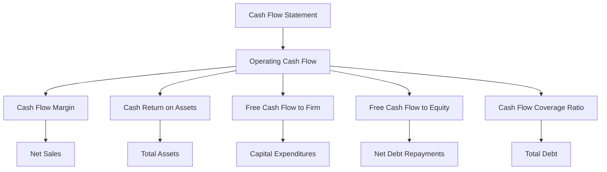

## 4.8 Cash Flow Ratios

Cash flow ratios are essential tools for analyzing a company's financial health and operational efficiency. Unlike traditional profitability ratios, which focus on net income, cash flow ratios provide insights into the actual cash generated by a company's operations. This section will delve into the significance of cash flow ratios, such as the cash flow margin and cash return on assets, and guide you through interpreting these metrics to assess a company's financial stability.

### Understanding Cash Flow Ratios

Cash flow ratios are derived from the cash flow statement, which is one of the three primary financial statements, alongside the balance sheet and income statement. These ratios help stakeholders understand how well a company generates cash to meet its obligations, invest in its operations, and return value to shareholders.

#### Key Cash Flow Ratios

1. **Cash Flow Margin**
   - **Definition:** The cash flow margin ratio measures the cash generated from operating activities as a percentage of sales. It indicates how efficiently a company converts sales into cash.
   - **Formula:** 
     
     \text{Cash Flow Margin} = \left( \frac{\text{Operating Cash Flow}}{\text{Net Sales}} \right) \times 100
     
   - **Interpretation:** A higher cash flow margin indicates better efficiency in converting sales into cash, which is crucial for maintaining liquidity and funding operations.

2. **Cash Return on Assets (CROA)**
   - **Definition:** This ratio measures how effectively a company uses its assets to generate cash flow from operations.
   - **Formula:** 
     
     \text{Cash Return on Assets} = \left( \frac{\text{Operating Cash Flow}}{\text{Total Assets}} \right) \times 100
     
   - **Interpretation:** A higher CROA suggests that the company is efficiently using its assets to generate cash, which is a positive indicator of operational efficiency.

3. **Free Cash Flow to Firm (FCFF)**
   - **Definition:** This ratio indicates the cash available to all capital providers, including debt and equity holders, after accounting for capital expenditures.
   - **Formula:** 
     
     \text{FCFF} = \text{Operating Cash Flow} - \text{Capital Expenditures}
     
   - **Interpretation:** Positive FCFF indicates that the company generates enough cash to cover its capital investments and still has excess cash to service debt or distribute to shareholders.

4. **Free Cash Flow to Equity (FCFE)**
   - **Definition:** This ratio measures the cash available to equity shareholders after accounting for capital expenditures and debt repayments.
   - **Formula:** 
     
     \text{FCFE} = \text{Operating Cash Flow} - \text{Capital Expenditures} - \text{Net Debt Repayments}
     
   - **Interpretation:** Positive FCFE suggests that the company can return cash to shareholders through dividends or share buybacks.

5. **Cash Flow Coverage Ratio**
   - **Definition:** This ratio assesses a company's ability to cover its debt obligations with its operating cash flow.
   - **Formula:** 
     
     \text{Cash Flow Coverage Ratio} = \frac{\text{Operating Cash Flow}}{\text{Total Debt}}
     
   - **Interpretation:** A higher ratio indicates a stronger ability to meet debt obligations, which is a sign of financial stability.

### Practical Examples and Case Studies

Let's explore how these ratios can be applied in real-world scenarios to assess a company's financial health.

#### Example 1: Evaluating a Retail Company

Consider a retail company, XYZ Corp, with the following financial data for the year:

- Operating Cash Flow: $500,000
- Net Sales: $2,000,000
- Total Assets: $1,500,000
- Capital Expenditures: $100,000
- Total Debt: $300,000

Let's calculate the cash flow ratios:

1. **Cash Flow Margin**
   
   \text{Cash Flow Margin} = \left( \frac{500,000}{2,000,000} \right) \times 100 = 25\%
   
   - **Interpretation:** XYZ Corp converts 25% of its sales into cash, indicating efficient cash generation from sales.

2. **Cash Return on Assets**
   
   \text{CROA} = \left( \frac{500,000}{1,500,000} \right) \times 100 = 33.33\%
   
   - **Interpretation:** The company effectively uses its assets to generate cash, with a CROA of 33.33%.

3. **Free Cash Flow to Firm**
   
   \text{FCFF} = 500,000 - 100,000 = 400,000
   
   - **Interpretation:** XYZ Corp has $400,000 available for debt servicing and shareholder returns after capital investments.

4. **Cash Flow Coverage Ratio**
   
   \text{Cash Flow Coverage Ratio} = \frac{500,000}{300,000} = 1.67
   
   - **Interpretation:** The company can cover its debt obligations 1.67 times with its operating cash flow, indicating strong financial stability.

#### Example 2: Analyzing a Manufacturing Firm

Consider a manufacturing firm, ABC Ltd, with the following financial data:

- Operating Cash Flow: $800,000
- Net Sales: $4,000,000
- Total Assets: $3,000,000
- Capital Expenditures: $200,000
- Net Debt Repayments: $150,000

Let's calculate the cash flow ratios:

1. **Cash Flow Margin**
   
   \text{Cash Flow Margin} = \left( \frac{800,000}{4,000,000} \right) \times 100 = 20\%
   
   - **Interpretation:** ABC Ltd converts 20% of its sales into cash, which is a healthy indicator of cash efficiency.

2. **Cash Return on Assets**
   
   \text{CROA} = \left( \frac{800,000}{3,000,000} \right) \times 100 = 26.67\%
   
   - **Interpretation:** The firm effectively utilizes its assets to generate cash, with a CROA of 26.67%.

3. **Free Cash Flow to Equity**
   
   \text{FCFE} = 800,000 - 200,000 - 150,000 = 450,000
   
   - **Interpretation:** ABC Ltd has $450,000 available for distribution to equity shareholders after capital expenditures and debt repayments.

### Real-World Applications and Regulatory Scenarios

Understanding cash flow ratios is crucial for various stakeholders, including investors, creditors, and management. These ratios provide insights into a company's liquidity, solvency, and overall financial health, which are vital for making informed decisions.

#### Investors

Investors use cash flow ratios to assess a company's ability to generate cash and return value to shareholders. Ratios like FCFE are particularly important for equity investors, as they indicate the cash available for dividends and share repurchases.

#### Creditors

Creditors rely on cash flow coverage ratios to evaluate a company's ability to meet its debt obligations. A higher ratio suggests a lower risk of default, making the company a more attractive borrower.

#### Management

For management, cash flow ratios serve as performance indicators, helping them identify areas for improvement in cash generation and asset utilization. These ratios also aid in strategic planning and investment decisions.

### Step-by-Step Guidance for Calculating Cash Flow Ratios

Calculating cash flow ratios involves several steps, which are outlined below:

1. **Gather Financial Data:** Obtain the necessary financial data from the cash flow statement, income statement, and balance sheet. This includes operating cash flow, net sales, total assets, capital expenditures, and debt obligations.

2. **Calculate Operating Cash Flow:** Ensure that the operating cash flow is accurately calculated, as it forms the basis for most cash flow ratios.

3. **Apply Formulas:** Use the formulas provided to calculate each cash flow ratio. Ensure that all figures are consistent and accurately reflect the company's financial position.

4. **Interpret Results:** Analyze the calculated ratios to assess the company's financial health. Compare the results with industry benchmarks and historical performance to gain deeper insights.

5. **Consider External Factors:** Take into account external factors such as economic conditions, industry trends, and regulatory changes that may impact the company's cash flow.

### Diagrams and Charts

To enhance understanding, let's include a diagram illustrating the relationship between cash flow ratios and financial statements.

### Best Practices and Common Pitfalls

- **Best Practices:**
  - Regularly review and update financial data to ensure accurate ratio calculations.
  - Compare cash flow ratios with industry benchmarks for a comprehensive analysis.
  - Use cash flow ratios in conjunction with other financial metrics for a holistic view of the company's financial health.

- **Common Pitfalls:**
  - Relying solely on cash flow ratios without considering other financial metrics.
  - Ignoring external factors that may impact cash flow, such as economic downturns or regulatory changes.
  - Failing to account for seasonal variations in cash flow, which can skew ratio interpretations.

### References and Additional Resources

For further exploration of cash flow ratios and their applications, consider the following resources:

- **CPA Canada:** Offers comprehensive guides and resources on financial analysis and cash flow management.
- **International Financial Reporting Standards (IFRS):** Provides guidelines on cash flow statement preparation and presentation.
- **Accounting Standards for Private Enterprises (ASPE):** Offers insights into cash flow reporting for private companies in Canada.

### Encouragement and Exam Strategies

Understanding cash flow ratios is a critical component of financial analysis and is frequently tested in Canadian accounting exams. To excel in this area:

- **Practice Calculations:** Regularly practice calculating cash flow ratios using sample financial statements.
- **Review Case Studies:** Analyze real-world case studies to understand the practical applications of cash flow ratios.
- **Stay Updated:** Keep abreast of changes in accounting standards and regulations that may impact cash flow reporting.

By mastering cash flow ratios, you'll be well-equipped to analyze a company's financial health and make informed decisions, both in exams and in your future accounting career.

## **Ready to Test Your Knowledge?**



### What does the cash flow margin ratio measure?

- [x] The efficiency of converting sales into cash
- [ ] The total cash flow from investing activities
- [ ] The ratio of cash flow to total debt
- [ ] The percentage of net income retained in the business

> **Explanation:** The cash flow margin ratio measures how efficiently a company converts its sales into cash, indicating its liquidity and operational efficiency.

### How is the cash return on assets (CROA) calculated?

- [x] Operating Cash Flow / Total Assets
- [ ] Net Income / Total Assets
- [ ] Operating Cash Flow / Net Sales
- [ ] Operating Cash Flow / Total Liabilities

> **Explanation:** CROA is calculated by dividing the operating cash flow by the total assets, reflecting how effectively a company uses its assets to generate cash.

### Which cash flow ratio indicates the cash available to equity shareholders after capital expenditures and debt repayments?

- [x] Free Cash Flow to Equity (FCFE)
- [ ] Free Cash Flow to Firm (FCFF)
- [ ] Cash Flow Margin
- [ ] Cash Flow Coverage Ratio

> **Explanation:** FCFE measures the cash available to equity shareholders after accounting for capital expenditures and debt repayments.

### What does a high cash flow coverage ratio indicate?

- [x] Strong ability to meet debt obligations
- [ ] Low liquidity risk
- [ ] High operational efficiency
- [ ] Increased net income

> **Explanation:** A high cash flow coverage ratio indicates a company's strong ability to cover its debt obligations with its operating cash flow.

### Which of the following is a common pitfall when analyzing cash flow ratios?

- [x] Relying solely on cash flow ratios without considering other financial metrics
- [ ] Comparing cash flow ratios with industry benchmarks
- [ ] Regularly updating financial data
- [ ] Using cash flow ratios in conjunction with other metrics

> **Explanation:** Relying solely on cash flow ratios without considering other financial metrics can lead to an incomplete analysis of a company's financial health.

### What is the formula for calculating Free Cash Flow to Firm (FCFF)?

- [x] Operating Cash Flow - Capital Expenditures
- [ ] Operating Cash Flow - Net Debt Repayments
- [ ] Operating Cash Flow / Total Debt
- [ ] Operating Cash Flow / Net Sales

> **Explanation:** FCFF is calculated by subtracting capital expenditures from operating cash flow, indicating the cash available to all capital providers.

### Why are cash flow ratios important for creditors?

- [x] They assess a company's ability to meet its debt obligations
- [ ] They measure a company's profitability
- [ ] They indicate the company's market share
- [ ] They reflect the company's stock performance

> **Explanation:** Creditors use cash flow ratios to evaluate a company's ability to meet its debt obligations, which is crucial for assessing credit risk.

### What is the significance of a positive Free Cash Flow to Equity (FCFE)?

- [x] It indicates cash available for dividends or share buybacks
- [ ] It reflects high net income
- [ ] It shows increased total assets
- [ ] It suggests a decrease in operating expenses

> **Explanation:** A positive FCFE indicates that the company has cash available to return to shareholders through dividends or share buybacks.

### How can management use cash flow ratios?

- [x] As performance indicators for strategic planning
- [ ] To determine the company's stock price
- [ ] To calculate tax liabilities
- [ ] To assess employee performance

> **Explanation:** Management uses cash flow ratios as performance indicators to identify areas for improvement and aid in strategic planning.

### True or False: Cash flow ratios are only relevant for large corporations.

- [ ] True
- [x] False

> **Explanation:** False. Cash flow ratios are relevant for businesses of all sizes, as they provide insights into financial health and operational efficiency.


