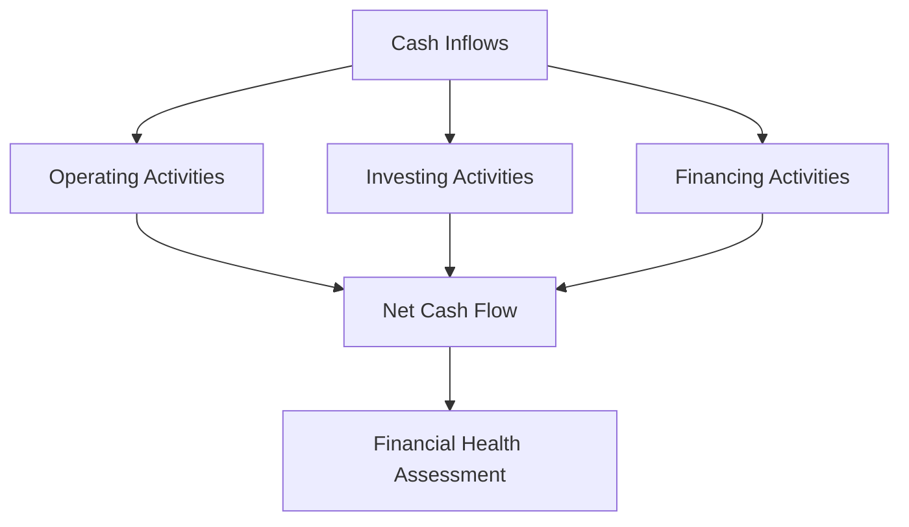

## 4.9 Interpreting Cash Flow Statements

Understanding and interpreting cash flow statements is crucial for assessing a company's financial health and sustainability. This section will guide you through the techniques and methodologies used to evaluate the quality and sustainability of cash flows, providing you with the knowledge needed to excel in Canadian accounting exams and in your professional career.

### Introduction to Cash Flow Statements

The cash flow statement is a financial statement that provides aggregate data regarding all cash inflows and outflows a company receives. It is divided into three main sections: cash flows from operating activities, investing activities, and financing activities. Each section provides insights into different aspects of a company's financial operations.

### Importance of Cash Flow Statements

Cash flow statements are vital for several reasons:

- **Liquidity Assessment:** They help assess the company's ability to generate cash to meet its obligations.
- **Financial Flexibility:** They provide insights into the company's financial flexibility and its ability to adapt to changing circumstances.
- **Investment Decisions:** Investors use cash flow statements to evaluate the viability and sustainability of their investments.
- **Performance Evaluation:** They offer a clear picture of how well a company manages its cash, which is crucial for assessing overall performance.

### Components of Cash Flow Statements

#### Cash Flows from Operating Activities

Operating activities include the primary revenue-generating activities of a business. This section of the cash flow statement indicates how much cash is generated from a company's core business operations.

- **Direct Method:** Lists all major operating cash receipts and payments during the period.
- **Indirect Method:** Adjusts net income for changes in balance sheet accounts to calculate cash from operating activities.

#### Cash Flows from Investing Activities

This section reflects the cash used for investing in the business, such as purchasing equipment or other long-term assets. It also includes cash received from the sale of these assets.

#### Cash Flows from Financing Activities

Financing activities include transactions involving debt, equity, and dividends. This section shows how a company raises capital and pays it back to investors through dividends and other means.

### Techniques for Interpreting Cash Flow Statements

Interpreting cash flow statements involves analyzing the data to assess the quality and sustainability of cash flows. Here are some techniques to consider:

#### Analyzing Operating Cash Flow

Operating cash flow is a key indicator of a company's financial health. It shows whether a company can generate sufficient positive cash flow to maintain and grow its operations.

- **Positive Operating Cash Flow:** Indicates that the company is generating enough cash from its core business activities.
- **Negative Operating Cash Flow:** May signal financial trouble, but it can also occur in rapidly growing companies investing heavily in their operations.

#### Evaluating Cash Flow Trends

Analyzing trends over multiple periods can provide insights into a company's financial trajectory. Look for consistent growth in operating cash flow, which suggests a healthy business.

#### Assessing Cash Flow Ratios

Cash flow ratios provide a more detailed analysis of a company's cash position:

- **Operating Cash Flow Ratio:** Measures the ability to cover current liabilities with cash generated from operations.
- **Free Cash Flow (FCF):** Indicates the cash available after capital expenditures, useful for assessing the company's ability to pursue growth opportunities.

#### Quality of Earnings

The quality of earnings ratio compares net income to operating cash flow. A high ratio suggests that earnings are supported by cash flow, indicating strong financial health.

#### Cash Flow Adequacy

This ratio assesses whether a company can cover its capital expenditures, debt repayments, and dividends with its operating cash flow.

#### Analyzing Cash Flow from Investing and Financing Activities

- **Investing Activities:** A net outflow is typically expected as companies invest in growth.
- **Financing Activities:** Analyze changes in debt and equity to understand how the company finances its operations.

### Practical Examples and Case Studies

#### Example 1: Assessing a Growing Company

Consider a tech startup with negative operating cash flow due to heavy investment in research and development. While this might initially seem concerning, the context of rapid growth and future revenue potential can justify the negative cash flow.

#### Example 2: Evaluating a Mature Company

A mature manufacturing company with positive operating cash flow and consistent free cash flow is likely in a strong financial position. Analyzing its cash flow statement can reveal its ability to sustain operations and return value to shareholders through dividends.

### Real-World Applications and Regulatory Scenarios

In Canada, companies must adhere to the International Financial Reporting Standards (IFRS) when preparing cash flow statements. Understanding these standards is crucial for interpreting cash flow statements accurately.

#### Compliance Considerations

- **IFRS Compliance:** Ensure that cash flow statements are prepared according to IFRS guidelines, which affect how cash flows are classified and reported.
- **ASPE Considerations:** For private enterprises, the Accounting Standards for Private Enterprises (ASPE) may apply, offering different guidelines for cash flow reporting.

### Step-by-Step Guidance for Cash Flow Analysis

1. **Review the Cash Flow Statement:** Start by examining the overall structure and components.
2. **Analyze Operating Cash Flow:** Focus on the cash generated from core operations.
3. **Evaluate Investing and Financing Activities:** Assess how the company invests and finances its operations.
4. **Calculate Key Ratios:** Use cash flow ratios to gain deeper insights into financial health.
5. **Consider External Factors:** Take into account industry trends and economic conditions that might impact cash flows.

### Diagrams and Visual Aids

To enhance understanding, let's visualize the flow of cash through a business using a Mermaid.js diagram:

### Best Practices and Common Pitfalls

- **Best Practices:** Regularly review cash flow statements to identify trends and potential issues early.
- **Common Pitfalls:** Avoid focusing solely on net income; cash flow provides a more comprehensive view of financial health.

### References and Additional Resources

- **CPA Canada:** Offers resources and guidelines for understanding and interpreting financial statements.
- **IFRS Foundation:** Provides detailed standards and interpretations for financial reporting.
- **Textbooks and Online Courses:** Consider additional study materials for deeper insights into cash flow analysis.

### Summary

Interpreting cash flow statements is a vital skill for accountants and financial analysts. By mastering the techniques outlined in this guide, you can assess the quality and sustainability of cash flows, providing valuable insights into a company's financial health.

## **Ready to Test Your Knowledge?**



### What is the primary purpose of a cash flow statement?

- [x] To provide information about cash inflows and outflows
- [ ] To calculate net income
- [ ] To assess tax liabilities
- [ ] To determine asset depreciation

> **Explanation:** The cash flow statement provides detailed information about a company's cash inflows and outflows, helping assess financial health.

### Which section of the cash flow statement reflects cash generated from core business operations?

- [x] Operating Activities
- [ ] Investing Activities
- [ ] Financing Activities
- [ ] Non-operating Activities

> **Explanation:** Operating activities include the primary revenue-generating activities of a business, reflecting cash generated from core operations.

### What does a positive operating cash flow indicate?

- [x] The company is generating sufficient cash from its core business activities
- [ ] The company is experiencing financial trouble
- [ ] The company has high levels of debt
- [ ] The company is investing heavily in growth

> **Explanation:** Positive operating cash flow indicates that a company is generating enough cash from its core business activities to sustain operations.

### What does the free cash flow (FCF) measure?

- [x] Cash available after capital expenditures
- [ ] Total revenue
- [ ] Net income
- [ ] Total liabilities

> **Explanation:** Free cash flow measures the cash available after capital expenditures, indicating the company's ability to pursue growth opportunities.

### How does the quality of earnings ratio help in cash flow analysis?

- [x] It compares net income to operating cash flow
- [ ] It measures the company's debt levels
- [ ] It assesses asset depreciation
- [ ] It evaluates tax liabilities

> **Explanation:** The quality of earnings ratio compares net income to operating cash flow, indicating whether earnings are supported by cash flow.

### What is the significance of cash flow adequacy?

- [x] It assesses the company's ability to cover capital expenditures, debt repayments, and dividends
- [ ] It measures total revenue
- [ ] It evaluates asset depreciation
- [ ] It determines tax liabilities

> **Explanation:** Cash flow adequacy assesses whether a company can cover its capital expenditures, debt repayments, and dividends with its operating cash flow.

### What should you consider when analyzing cash flow from investing activities?

- [x] Net outflow as companies invest in growth
- [ ] Total revenue
- [ ] Net income
- [ ] Total liabilities

> **Explanation:** A net outflow in investing activities is typically expected as companies invest in growth, reflecting their long-term strategy.

### Which accounting standard must Canadian companies adhere to for cash flow statements?

- [x] IFRS
- [ ] GAAP
- [ ] ASPE
- [ ] FASB

> **Explanation:** Canadian companies must adhere to the International Financial Reporting Standards (IFRS) when preparing cash flow statements.

### What is a common pitfall in cash flow analysis?

- [x] Focusing solely on net income
- [ ] Analyzing trends over multiple periods
- [ ] Calculating key ratios
- [ ] Assessing external factors

> **Explanation:** Focusing solely on net income can be misleading; cash flow provides a more comprehensive view of financial health.

### True or False: A negative operating cash flow always indicates financial trouble.

- [ ] True
- [x] False

> **Explanation:** A negative operating cash flow may not always indicate financial trouble, especially in rapidly growing companies investing heavily in their operations.


