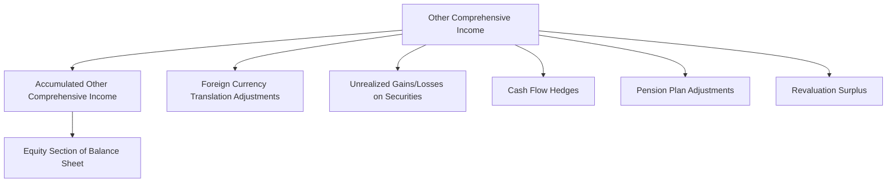

## 5.7 Accumulated Other Comprehensive Income

Accumulated Other Comprehensive Income (AOCI) is a critical component of a company's financial statements, particularly within the Statement of Changes in Equity. It represents the cumulative amount of other comprehensive income (OCI), which includes unrealized gains and losses that are not recognized in the net income. Understanding AOCI is essential for interpreting a company's financial health and making informed business decisions. In this section, we will delve into the concept of AOCI, its components, and its significance in financial reporting, with a focus on Canadian accounting standards and practices.

### Understanding Accumulated Other Comprehensive Income

Accumulated Other Comprehensive Income is a section of equity that aggregates the net amount of other comprehensive income over time. It reflects changes in equity that are not captured in the income statement, providing a broader view of a company's financial performance. AOCI includes items such as foreign currency translation adjustments, unrealized gains and losses on available-for-sale securities, and changes in the fair value of certain hedging instruments.

#### Key Components of AOCI

1. **Foreign Currency Translation Adjustments**: These arise when a company has foreign operations and the financial statements of those operations are translated into the reporting currency. The translation process can result in gains or losses due to fluctuations in exchange rates.

2. **Unrealized Gains and Losses on Available-for-Sale Securities**: These are securities that a company intends to hold for an indefinite period but may sell in response to changes in interest rates or other factors. Changes in the fair value of these securities are recorded in OCI until they are sold.

3. **Cash Flow Hedges**: When a company uses derivatives to hedge against cash flow variability, the effective portion of the gain or loss on the hedging instrument is initially reported in OCI. It is later reclassified into earnings when the hedged transaction affects profit or loss.

4. **Pension and Post-Retirement Benefit Plans**: Changes in the funded status of defined benefit plans, such as actuarial gains and losses, are recorded in OCI.

5. **Revaluation Surplus**: Under certain accounting frameworks, companies may revalue their property, plant, and equipment to fair value. The revaluation surplus is recorded in OCI.

### Importance of AOCI in Financial Reporting

AOCI provides valuable insights into a company's financial position by capturing economic events that affect equity but do not impact net income. It enhances transparency and allows stakeholders to assess the potential future impact of these items on the company's financial performance.

#### Canadian Accounting Standards and AOCI

In Canada, companies follow International Financial Reporting Standards (IFRS) or Accounting Standards for Private Enterprises (ASPE). Both frameworks have specific guidelines for reporting OCI and AOCI.

- **IFRS**: Under IFRS, OCI is presented in a separate section of the Statement of Comprehensive Income. AOCI is reported in the Statement of Changes in Equity, showing the cumulative effect of OCI items.

- **ASPE**: While ASPE does not require a separate Statement of Comprehensive Income, it does allow for the presentation of OCI items in the equity section of the balance sheet.

### Practical Examples and Case Studies

To illustrate the concept of AOCI, let's consider a Canadian multinational corporation with significant foreign operations and investments in available-for-sale securities.

#### Example 1: Foreign Currency Translation Adjustments

Imagine a Canadian company with a subsidiary in Europe. The subsidiary's financial statements are prepared in euros, but the parent company's reporting currency is Canadian dollars. Due to fluctuations in the exchange rate between the euro and the Canadian dollar, the translation of the subsidiary's financial statements results in a foreign currency translation adjustment. This adjustment is recorded in OCI and accumulates in AOCI.

#### Example 2: Unrealized Gains and Losses on Securities

Suppose the same company holds a portfolio of available-for-sale securities. During the year, the fair value of these securities increases due to favorable market conditions. The unrealized gain is recorded in OCI and accumulates in AOCI. If the company later sells the securities, the gain is reclassified from OCI to net income.

### Real-World Applications and Regulatory Scenarios

Understanding AOCI is crucial for investors, analysts, and other stakeholders who rely on financial statements to make informed decisions. It provides a more comprehensive view of a company's financial health and potential risks.

#### Regulatory Considerations

Canadian companies must comply with the disclosure requirements set forth by regulatory bodies such as the Canadian Securities Administrators (CSA) and the Chartered Professional Accountants of Canada (CPA Canada). These requirements ensure that companies provide transparent and consistent information about AOCI in their financial statements.

### Step-by-Step Guidance for Analyzing AOCI

1. **Identify OCI Items**: Review the Statement of Comprehensive Income to identify the components of OCI.

2. **Assess the Impact on Equity**: Examine the Statement of Changes in Equity to understand how OCI items accumulate in AOCI.

3. **Evaluate the Potential Impact on Future Earnings**: Consider how changes in AOCI might affect future net income, particularly if OCI items are reclassified.

4. **Analyze Trends**: Look for trends in AOCI over time to assess the company's exposure to risks such as currency fluctuations or changes in market conditions.

### Diagrams and Visuals

To enhance understanding, let's use a Mermaid.js diagram to illustrate the flow of OCI items into AOCI.

### Best Practices and Common Pitfalls

- **Best Practices**: Regularly review and update the components of OCI to ensure accurate reporting. Provide clear disclosures about the nature and impact of OCI items.

- **Common Pitfalls**: Failing to adequately disclose the components of OCI can lead to misunderstandings about a company's financial position. Ensure that all relevant information is included in the financial statements.

### References to Official Canadian Accounting Standards

For further exploration, refer to the following resources:

- **IFRS Standards**: Visit the IFRS Foundation website for detailed information on the standards related to OCI and AOCI.

- **CPA Canada**: Access CPA Canada's resources for guidance on financial reporting and compliance with Canadian accounting standards.

### Summary and Key Takeaways

Accumulated Other Comprehensive Income is a vital component of a company's financial statements, providing insights into unrealized gains and losses that affect equity. Understanding AOCI is essential for interpreting a company's financial health and making informed business decisions. By following best practices and complying with regulatory requirements, companies can ensure transparent and accurate reporting of AOCI.

## **Ready to Test Your Knowledge?**



### What is Accumulated Other Comprehensive Income (AOCI)?

- [x] A section of equity that aggregates the net amount of other comprehensive income over time.
- [ ] A measure of a company's net income.
- [ ] A component of the income statement.
- [ ] A liability on the balance sheet.

> **Explanation:** AOCI is a section of equity that aggregates the net amount of other comprehensive income over time, reflecting changes in equity not captured in the income statement.

### Which of the following is NOT typically included in AOCI?

- [ ] Foreign currency translation adjustments
- [ ] Unrealized gains and losses on available-for-sale securities
- [x] Depreciation expense
- [ ] Cash flow hedges

> **Explanation:** Depreciation expense is recognized in the income statement, not in AOCI.

### How are unrealized gains and losses on available-for-sale securities reported?

- [x] In other comprehensive income and accumulated in AOCI
- [ ] Directly in net income
- [ ] As a liability on the balance sheet
- [ ] As an asset on the balance sheet

> **Explanation:** Unrealized gains and losses on available-for-sale securities are reported in other comprehensive income and accumulated in AOCI until realized.

### What is the role of AOCI in financial reporting?

- [x] It provides insights into unrealized gains and losses that affect equity.
- [ ] It measures a company's profitability.
- [ ] It indicates a company's cash flow position.
- [ ] It represents a company's total liabilities.

> **Explanation:** AOCI provides insights into unrealized gains and losses that affect equity, offering a broader view of a company's financial performance.

### Which accounting framework requires a separate Statement of Comprehensive Income?

- [x] IFRS
- [ ] ASPE
- [ ] GAAP
- [ ] None of the above

> **Explanation:** IFRS requires a separate Statement of Comprehensive Income, while ASPE does not.

### What is the impact of foreign currency translation adjustments on AOCI?

- [x] They result in gains or losses recorded in OCI and accumulated in AOCI.
- [ ] They are recognized directly in net income.
- [ ] They are recorded as a liability.
- [ ] They have no impact on AOCI.

> **Explanation:** Foreign currency translation adjustments result in gains or losses recorded in OCI and accumulated in AOCI.

### How can companies ensure accurate reporting of AOCI?

- [x] By regularly reviewing and updating the components of OCI.
- [ ] By ignoring unrealized gains and losses.
- [ ] By only reporting realized gains and losses.
- [ ] By excluding OCI from financial statements.

> **Explanation:** Companies can ensure accurate reporting of AOCI by regularly reviewing and updating the components of OCI.

### What is the significance of AOCI for investors?

- [x] It provides a comprehensive view of a company's financial health.
- [ ] It indicates a company's short-term profitability.
- [ ] It measures a company's cash flow.
- [ ] It represents a company's liabilities.

> **Explanation:** AOCI provides a comprehensive view of a company's financial health, offering insights into unrealized gains and losses.

### Which of the following is a best practice for reporting AOCI?

- [x] Providing clear disclosures about the nature and impact of OCI items.
- [ ] Minimizing the disclosure of OCI items.
- [ ] Reporting OCI items only when realized.
- [ ] Excluding OCI items from financial statements.

> **Explanation:** Providing clear disclosures about the nature and impact of OCI items is a best practice for reporting AOCI.

### True or False: AOCI is a liability on the balance sheet.

- [ ] True
- [x] False

> **Explanation:** False. AOCI is a component of equity, not a liability on the balance sheet.


