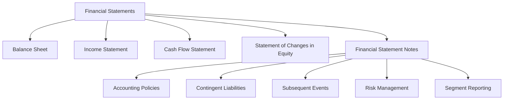

## 6.1 Importance of Financial Statement Notes

Financial statement notes, often referred to as footnotes, are an integral part of a company's financial statements. They provide additional information and context that are not readily apparent in the main financial statements themselves. Understanding these notes is crucial for anyone analyzing financial statements, as they offer insights into the accounting policies, methodologies, and assumptions used by the company. This section will delve into the importance of financial statement notes, their components, and how they enhance the understanding of financial statements.

### The Role of Financial Statement Notes

Financial statement notes serve several critical functions:

1. **Clarification and Context**: They clarify the figures presented in the financial statements by providing detailed explanations of the accounting policies and methods used. This is essential for understanding how the numbers were derived and what they represent.

2. **Disclosure of Additional Information**: Notes disclose information that cannot be included in the main financial statements due to space constraints or complexity. This includes details about contingent liabilities, commitments, and subsequent events.

3. **Compliance with Standards**: They ensure compliance with accounting standards such as the International Financial Reporting Standards (IFRS) and the Accounting Standards for Private Enterprises (ASPE) in Canada. These standards often require specific disclosures to provide a complete picture of a company's financial position.

4. **Risk Assessment**: Notes provide insights into the risks faced by the company, such as credit risk, market risk, and liquidity risk. This information is vital for investors and analysts assessing the company's risk profile.

5. **Enhancing Transparency and Comparability**: By providing detailed disclosures, financial statement notes enhance the transparency and comparability of financial statements, allowing stakeholders to make more informed decisions.

### Key Components of Financial Statement Notes

Financial statement notes typically include the following components:

1. **Summary of Significant Accounting Policies**: This section outlines the major accounting policies and methods used in preparing the financial statements. It includes information on revenue recognition, inventory valuation, depreciation methods, and more.

2. **Detailed Breakdowns of Financial Statement Items**: Notes provide detailed breakdowns of significant financial statement items, such as property, plant, and equipment, intangible assets, and debt obligations.

3. **Contingent Liabilities and Commitments**: This section discloses potential liabilities that may arise from past events, such as lawsuits or guarantees. It also includes commitments for future expenditures.

4. **Subsequent Events**: Notes disclose events that occur after the balance sheet date but before the financial statements are issued, which may have a significant impact on the company's financial position.

5. **Related Party Transactions**: This section provides details of transactions with related parties, such as subsidiaries, associates, or key management personnel, which may not be conducted on an arm's length basis.

6. **Risk Management Disclosures**: Notes include information on the company's risk management policies and practices, including how it manages financial risks such as currency risk, interest rate risk, and credit risk.

7. **Segment Reporting**: For companies operating in multiple segments, notes provide information on the financial performance of each segment, enhancing the understanding of the company's operations.

8. **Significant Estimates and Judgments**: This section discloses significant estimates and judgments made by management in preparing the financial statements, which can affect the reported amounts of assets, liabilities, income, and expenses.

### Practical Examples and Case Studies

To illustrate the importance of financial statement notes, consider the following examples:

#### Example 1: Revenue Recognition

A company reports $1 million in revenue for the year. The financial statement notes reveal that this revenue includes $200,000 from a long-term contract that is recognized over time based on the percentage of completion method. Without this note, an analyst might incorrectly assume that all revenue was earned during the year.

#### Example 2: Contingent Liabilities

A company is involved in a lawsuit with a potential liability of $500,000. The financial statement notes disclose this contingent liability and explain that the company believes it is not probable that it will have to pay this amount. This information is crucial for assessing the company's financial health and risk.

#### Example 3: Subsequent Events

After the balance sheet date, a company acquires another business for $2 million. The financial statement notes disclose this subsequent event, providing stakeholders with information about the company's growth strategy and future prospects.

### Real-World Applications and Regulatory Scenarios

In the real world, financial statement notes are critical for regulatory compliance and investor relations. Companies must adhere to the disclosure requirements set by accounting standards and regulatory bodies such as the Canadian Securities Administrators (CSA) and CPA Canada. Failure to provide adequate disclosures can result in regulatory penalties and damage to the company's reputation.

### Step-by-Step Guidance for Analyzing Financial Statement Notes

1. **Identify the Key Areas**: Start by identifying the key areas covered in the financial statement notes, such as accounting policies, contingent liabilities, and risk management.

2. **Understand the Accounting Policies**: Pay close attention to the summary of significant accounting policies, as these can significantly impact the financial statements.

3. **Analyze the Detailed Breakdowns**: Review the detailed breakdowns of financial statement items to understand the composition and valuation of assets and liabilities.

4. **Assess the Risks and Uncertainties**: Evaluate the disclosures related to risks and uncertainties, such as contingent liabilities and subsequent events, to assess the company's risk profile.

5. **Compare with Industry Peers**: Compare the financial statement notes with those of industry peers to assess the company's relative position and performance.

### Diagrams and Visuals

To enhance understanding, consider the following diagram illustrating the relationship between financial statements and notes:

### Best Practices, Common Pitfalls, and Strategies

**Best Practices:**

- **Thoroughly Review All Notes**: Ensure you review all financial statement notes, as they provide essential context and information.
- **Focus on Significant Disclosures**: Pay special attention to significant disclosures that may impact the financial statements.
- **Stay Updated on Standards**: Keep abreast of changes in accounting standards and disclosure requirements.

**Common Pitfalls:**

- **Overlooking Important Details**: Avoid overlooking important details in the notes that could affect your analysis.
- **Misinterpreting Accounting Policies**: Be cautious not to misinterpret the accounting policies disclosed in the notes.

**Strategies:**

- **Use a Checklist**: Use a checklist to ensure you cover all key areas when analyzing financial statement notes.
- **Practice with Real-World Examples**: Practice analyzing financial statement notes using real-world examples to enhance your skills.

### References and Additional Resources

- **CPA Canada**: Visit the CPA Canada website for resources on financial reporting and disclosure requirements.
- **IFRS Foundation**: The IFRS Foundation provides comprehensive resources on IFRS standards and disclosures.
- **Canadian Securities Administrators (CSA)**: The CSA website offers guidance on regulatory disclosure requirements in Canada.

### Summary

Financial statement notes are a vital component of financial reporting, providing essential information and context that enhance the understanding of financial statements. By thoroughly analyzing these notes, you can gain valuable insights into a company's financial position, performance, and risk profile. As you prepare for the Canadian Accounting Exams, mastering the interpretation of financial statement notes will be crucial for success.

## **Ready to Test Your Knowledge?**



### What is the primary purpose of financial statement notes?

- [x] To provide additional information and context to the financial statements
- [ ] To summarize the financial statements
- [ ] To replace the financial statements
- [ ] To provide tax advice

> **Explanation:** Financial statement notes provide additional information and context that enhance the understanding of the financial statements.

### Which of the following is typically included in financial statement notes?

- [x] Summary of significant accounting policies
- [ ] Tax returns
- [ ] Marketing strategies
- [ ] Employee performance reviews

> **Explanation:** Financial statement notes typically include a summary of significant accounting policies, among other disclosures.

### Why are contingent liabilities disclosed in financial statement notes?

- [x] To inform stakeholders of potential liabilities that may arise from past events
- [ ] To hide liabilities from stakeholders
- [ ] To inflate the company's financial position
- [ ] To comply with tax regulations

> **Explanation:** Contingent liabilities are disclosed to inform stakeholders of potential liabilities that may arise from past events.

### What is the significance of subsequent events in financial statement notes?

- [x] They provide information about events occurring after the balance sheet date that may impact the company's financial position
- [ ] They summarize past financial performance
- [ ] They provide future financial forecasts
- [ ] They detail employee benefits

> **Explanation:** Subsequent events provide information about events occurring after the balance sheet date that may impact the company's financial position.

### How do financial statement notes enhance transparency?

- [x] By providing detailed disclosures and explanations of financial statement items
- [ ] By summarizing the financial statements
- [ ] By hiding complex information
- [ ] By providing tax advice

> **Explanation:** Financial statement notes enhance transparency by providing detailed disclosures and explanations of financial statement items.

### What is the benefit of segment reporting in financial statement notes?

- [x] It provides information on the financial performance of different segments of the company
- [ ] It summarizes the company's overall performance
- [ ] It provides tax advice
- [ ] It details employee benefits

> **Explanation:** Segment reporting provides information on the financial performance of different segments of the company.

### Why is it important to understand the accounting policies disclosed in financial statement notes?

- [x] They significantly impact the financial statements and provide context for the figures presented
- [ ] They summarize the company's marketing strategies
- [ ] They provide tax advice
- [ ] They detail employee benefits

> **Explanation:** Understanding accounting policies is important because they significantly impact the financial statements and provide context for the figures presented.

### What is a common pitfall when analyzing financial statement notes?

- [x] Overlooking important details that could affect the analysis
- [ ] Focusing too much on the financial statements
- [ ] Ignoring the company's marketing strategies
- [ ] Misinterpreting tax regulations

> **Explanation:** A common pitfall is overlooking important details in the notes that could affect the analysis.

### How can you enhance your skills in analyzing financial statement notes?

- [x] Practice with real-world examples
- [ ] Focus only on the financial statements
- [ ] Ignore accounting standards
- [ ] Rely solely on tax advice

> **Explanation:** Practicing with real-world examples can enhance your skills in analyzing financial statement notes.

### True or False: Financial statement notes are optional and not required for compliance with accounting standards.

- [ ] True
- [x] False

> **Explanation:** Financial statement notes are required for compliance with accounting standards and provide essential information for understanding the financial statements.


