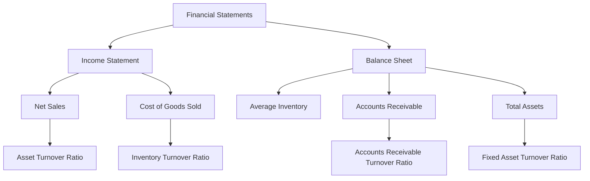

## 7.8 Efficiency Ratios

Efficiency ratios are vital tools in financial analysis, providing insights into how well a company utilizes its assets and manages its liabilities. These ratios help stakeholders, including investors, creditors, and management, assess the operational effectiveness of a business. Understanding efficiency ratios is crucial for those preparing for Canadian accounting exams, as they form a significant part of financial statement analysis.

### Understanding Efficiency Ratios

Efficiency ratios, also known as activity ratios, measure how effectively a company uses its resources to generate revenue. They focus on the relationship between the income statement and the balance sheet, providing a snapshot of the operational efficiency of a business. By analyzing these ratios, you can determine how well a company is managing its assets and liabilities to maximize profitability.

### Key Efficiency Ratios

1. **Inventory Turnover Ratio**
   - **Definition:** This ratio measures how many times a company's inventory is sold and replaced over a period. It indicates the efficiency of inventory management.
   - **Formula:** 
     
     \text{Inventory Turnover Ratio} = \frac{\text{Cost of Goods Sold (COGS)}}{\text{Average Inventory}}
     
   - **Interpretation:** A higher inventory turnover ratio suggests efficient inventory management, while a lower ratio may indicate overstocking or obsolescence.

2. **Days Sales Outstanding (DSO)**
   - **Definition:** DSO measures the average number of days it takes a company to collect payment after a sale. It reflects the effectiveness of credit and collection policies.
   - **Formula:**
     
     \text{DSO} = \frac{\text{Accounts Receivable}}{\text{Total Credit Sales}} \times \text{Number of Days}
     
   - **Interpretation:** A lower DSO indicates faster collection of receivables, enhancing cash flow, whereas a higher DSO may signal collection issues.

3. **Accounts Receivable Turnover Ratio**
   - **Definition:** This ratio assesses how efficiently a company collects its receivables.
   - **Formula:**
     
     \text{Accounts Receivable Turnover} = \frac{\text{Net Credit Sales}}{\text{Average Accounts Receivable}}
     
   - **Interpretation:** A higher turnover ratio implies effective credit policies and prompt collection, while a lower ratio may indicate inefficiencies.

4. **Accounts Payable Turnover Ratio**
   - **Definition:** This ratio measures how quickly a company pays off its suppliers.
   - **Formula:**
     
     \text{Accounts Payable Turnover} = \frac{\text{Cost of Goods Sold}}{\text{Average Accounts Payable}}
     
   - **Interpretation:** A higher ratio suggests prompt payment to suppliers, which can enhance supplier relationships, while a lower ratio may indicate cash flow management issues.

5. **Asset Turnover Ratio**
   - **Definition:** This ratio evaluates how efficiently a company uses its assets to generate sales.
   - **Formula:**
     
     \text{Asset Turnover Ratio} = \frac{\text{Net Sales}}{\text{Average Total Assets}}
     
   - **Interpretation:** A higher asset turnover ratio indicates efficient use of assets, while a lower ratio suggests underutilization.

6. **Fixed Asset Turnover Ratio**
   - **Definition:** This ratio measures how well a company uses its fixed assets to generate sales.
   - **Formula:**
     
     \text{Fixed Asset Turnover Ratio} = \frac{\text{Net Sales}}{\text{Average Net Fixed Assets}}
     
   - **Interpretation:** A higher ratio indicates efficient use of fixed assets, while a lower ratio may suggest inefficiencies or underutilization.

### Practical Examples and Case Studies

#### Example 1: Inventory Turnover Ratio

Consider a Canadian retail company, Maple Retailers Inc., with a COGS of $500,000 and an average inventory of $100,000. The inventory turnover ratio would be:


\text{Inventory Turnover Ratio} = \frac{500,000}{100,000} = 5


This indicates that Maple Retailers Inc. sells and replaces its inventory five times a year. A comparison with industry averages can provide further insights into the company's inventory management efficiency.

#### Example 2: Days Sales Outstanding (DSO)

Suppose Northern Tech Solutions has accounts receivable of $150,000 and total credit sales of $1,200,000 in a year. Assuming a 365-day year, the DSO would be:


\text{DSO} = \frac{150,000}{1,200,000} \times 365 = 45.63 \text{ days}


This means it takes Northern Tech Solutions approximately 46 days to collect payments, which can be compared to industry standards to assess efficiency.

### Real-World Applications and Regulatory Scenarios

Efficiency ratios are not only theoretical concepts but have practical applications in various real-world scenarios:

- **Investment Analysis:** Investors use efficiency ratios to evaluate a company's operational performance and make informed investment decisions.
- **Credit Assessment:** Creditors assess efficiency ratios to determine a company's creditworthiness and its ability to manage liabilities.
- **Management Decision-Making:** Management teams rely on efficiency ratios to identify areas for operational improvement and strategic planning.

In Canada, adherence to accounting standards such as IFRS and ASPE ensures consistency and reliability in financial reporting, which is crucial for accurate efficiency ratio analysis.

### Step-by-Step Guidance for Calculation

To calculate efficiency ratios effectively, follow these steps:

1. **Gather Financial Data:** Obtain the necessary financial data from the company's financial statements, including the income statement and balance sheet.
2. **Identify Relevant Figures:** Identify the figures required for each ratio, such as COGS, net sales, accounts receivable, and total assets.
3. **Apply Formulas:** Use the formulas provided to calculate each efficiency ratio.
4. **Interpret Results:** Analyze the results in the context of industry benchmarks and historical performance to draw meaningful conclusions.

### Diagrams and Charts

To enhance understanding, consider the following Mermaid.js diagram illustrating the relationship between key efficiency ratios and financial statements:

### Best Practices and Common Pitfalls

- **Best Practices:**
  - Regularly monitor efficiency ratios to track performance over time.
  - Compare ratios with industry peers to identify competitive advantages or areas for improvement.
  - Use efficiency ratios in conjunction with other financial metrics for a comprehensive analysis.

- **Common Pitfalls:**
  - Relying solely on efficiency ratios without considering qualitative factors.
  - Ignoring seasonal variations that may affect inventory and sales cycles.
  - Failing to update calculations with the most recent financial data.

### Exam Focus and Practice Questions

Efficiency ratios are frequently tested in Canadian accounting exams. Focus on understanding the formulas, interpretations, and applications of each ratio. Practice calculating ratios using sample financial statements and compare your results with industry benchmarks.

## **Ready to Test Your Knowledge?**



### Which ratio measures how many times a company's inventory is sold and replaced over a period?

- [x] Inventory Turnover Ratio
- [ ] Days Sales Outstanding
- [ ] Asset Turnover Ratio
- [ ] Accounts Payable Turnover Ratio

> **Explanation:** The Inventory Turnover Ratio measures how many times a company's inventory is sold and replaced over a period, indicating inventory management efficiency.

### What does a high Days Sales Outstanding (DSO) indicate?

- [ ] Fast collection of receivables
- [x] Slow collection of receivables
- [ ] Efficient inventory management
- [ ] High asset utilization

> **Explanation:** A high DSO indicates slow collection of receivables, which may signal collection issues or lenient credit policies.

### How is the Accounts Receivable Turnover Ratio calculated?

- [ ] Net Sales / Average Total Assets
- [x] Net Credit Sales / Average Accounts Receivable
- [ ] Cost of Goods Sold / Average Inventory
- [ ] Net Sales / Average Net Fixed Assets

> **Explanation:** The Accounts Receivable Turnover Ratio is calculated by dividing net credit sales by average accounts receivable, measuring the efficiency of receivables collection.

### Which ratio evaluates how efficiently a company uses its assets to generate sales?

- [ ] Inventory Turnover Ratio
- [ ] Days Sales Outstanding
- [x] Asset Turnover Ratio
- [ ] Accounts Payable Turnover Ratio

> **Explanation:** The Asset Turnover Ratio evaluates how efficiently a company uses its assets to generate sales, indicating asset utilization effectiveness.

### What does a low Accounts Payable Turnover Ratio suggest?

- [x] Slow payment to suppliers
- [ ] Fast payment to suppliers
- [ ] High inventory turnover
- [ ] Efficient receivables collection

> **Explanation:** A low Accounts Payable Turnover Ratio suggests slow payment to suppliers, which may indicate cash flow management issues.

### Which ratio measures how well a company uses its fixed assets to generate sales?

- [ ] Inventory Turnover Ratio
- [ ] Days Sales Outstanding
- [ ] Accounts Receivable Turnover Ratio
- [x] Fixed Asset Turnover Ratio

> **Explanation:** The Fixed Asset Turnover Ratio measures how well a company uses its fixed assets to generate sales, indicating fixed asset utilization efficiency.

### What is the formula for the Inventory Turnover Ratio?

- [x] Cost of Goods Sold / Average Inventory
- [ ] Net Sales / Average Total Assets
- [ ] Net Credit Sales / Average Accounts Receivable
- [ ] Cost of Goods Sold / Average Accounts Payable

> **Explanation:** The Inventory Turnover Ratio is calculated by dividing the cost of goods sold by average inventory, measuring inventory management efficiency.

### What does a high Asset Turnover Ratio indicate?

- [x] Efficient use of assets
- [ ] Inefficient use of assets
- [ ] Slow collection of receivables
- [ ] Slow payment to suppliers

> **Explanation:** A high Asset Turnover Ratio indicates efficient use of assets to generate sales, reflecting effective asset utilization.

### Which ratio helps assess the effectiveness of credit and collection policies?

- [ ] Inventory Turnover Ratio
- [x] Days Sales Outstanding
- [ ] Asset Turnover Ratio
- [ ] Fixed Asset Turnover Ratio

> **Explanation:** Days Sales Outstanding helps assess the effectiveness of credit and collection policies by measuring the average number of days to collect payment.

### True or False: Efficiency ratios are only relevant for large corporations.

- [ ] True
- [x] False

> **Explanation:** False. Efficiency ratios are relevant for businesses of all sizes, providing insights into operational effectiveness and asset utilization.



By mastering efficiency ratios, you can gain valuable insights into a company's operational performance and asset management. These ratios are essential tools for financial analysis, helping you make informed decisions and excel in your Canadian accounting exams.
