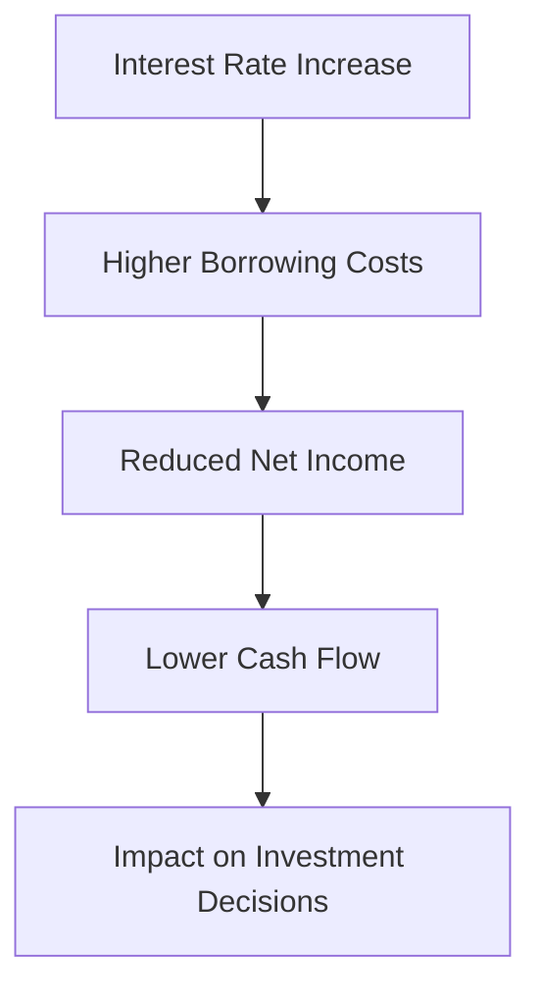

## 9.8 Impact of Macroeconomic Factors

Understanding the impact of macroeconomic factors on financial statements is crucial for investors, accountants, and financial analysts. Macroeconomic factors, such as inflation, interest rates, exchange rates, and economic growth, can significantly influence a company's financial performance and, consequently, its financial statements. This section delves into how these external economic influences affect financial statements and investment decisions, with a focus on Canadian accounting standards and practices.

### Understanding Macroeconomic Factors

Macroeconomic factors are the external economic conditions that affect the economy as a whole, influencing the financial health of businesses and the decisions of investors. These factors include:

1. **Inflation:** The rate at which the general level of prices for goods and services rises, eroding purchasing power.
2. **Interest Rates:** The cost of borrowing money, which affects consumer spending and business investment.
3. **Exchange Rates:** The value of one currency for the purpose of conversion to another, impacting international trade and investments.
4. **Economic Growth:** The increase in the market value of the goods and services produced by an economy over time.
5. **Unemployment Rates:** The percentage of the labor force that is jobless and actively seeking employment.
6. **Government Policies:** Fiscal and monetary policies that can influence economic activity.

### The Influence of Inflation on Financial Statements

Inflation affects financial statements in several ways:

- **Revenue Recognition:** Inflation can lead to higher sales prices, affecting revenue figures. However, if costs rise faster than prices, profit margins may shrink.
- **Cost of Goods Sold (COGS):** Inflation increases the cost of raw materials and labor, impacting the COGS and gross profit.
- **Inventory Valuation:** Inflation can lead to inventory valuation challenges. Under the FIFO (First-In, First-Out) method, older, cheaper inventory costs are matched against current revenues, potentially inflating profits. Conversely, the LIFO (Last-In, First-Out) method may result in lower profits due to higher current costs.
- **Depreciation:** Inflation affects the replacement cost of assets, which can lead to under-depreciation if historical cost accounting is used.

#### Example: Inflation Impact on a Canadian Retailer

Consider a Canadian retailer that uses the FIFO method for inventory valuation. During a period of high inflation, the cost of purchasing new inventory rises significantly. As a result, the retailer's older, lower-cost inventory is sold at current higher prices, leading to increased reported profits. However, the actual purchasing power of these profits may be overstated, as the cost to replace inventory has risen.

### Interest Rates and Their Effect on Financial Statements

Interest rates influence financial statements through:

- **Borrowing Costs:** Higher interest rates increase the cost of borrowing, affecting net income and cash flow.
- **Investment Decisions:** Companies may delay or reduce capital investments due to higher financing costs.
- **Valuation of Financial Instruments:** Interest rate changes affect the valuation of bonds and other interest-sensitive securities.

#### Case Study: Interest Rate Impact on a Canadian Manufacturing Firm

A Canadian manufacturing firm with significant debt may face increased interest expenses when rates rise. This can reduce net income and cash flow, potentially affecting the firm's ability to invest in new projects or pay dividends. Additionally, higher interest rates may lead to a decrease in the market value of the firm's bonds, affecting its balance sheet.

### Exchange Rates and Their Impact on Financial Statements

Exchange rates affect financial statements in the following ways:

- **Revenue and Expenses:** Companies with international operations face exchange rate risk, which can impact revenues and expenses when foreign currency transactions are converted to the home currency.
- **Translation of Foreign Subsidiaries:** The financial statements of foreign subsidiaries must be translated into the parent company's reporting currency, affecting consolidated financial results.
- **Hedging Activities:** Companies may use hedging instruments to mitigate exchange rate risk, impacting financial statement disclosures.

#### Scenario: Exchange Rate Fluctuations for a Canadian Exporter

A Canadian exporter selling products in the United States may benefit from a weaker Canadian dollar, as it makes Canadian goods cheaper for U.S. buyers, potentially increasing sales. However, if the Canadian dollar strengthens, the exporter may face reduced competitiveness and lower revenues when converted back to Canadian dollars.

### Economic Growth and Its Influence on Financial Statements

Economic growth affects financial statements by:

- **Sales and Revenue Growth:** A growing economy typically leads to increased consumer spending and higher sales for businesses.
- **Investment in Expansion:** Companies may invest in new projects and expand operations during periods of economic growth.
- **Credit Availability:** Economic growth often leads to more favorable credit conditions, allowing businesses to finance expansion at lower costs.

#### Example: Economic Growth Impact on a Canadian Tech Company

A Canadian tech company may experience increased demand for its products during periods of economic growth, leading to higher sales and revenue. This growth may enable the company to invest in research and development, further enhancing its competitive position.

### Unemployment Rates and Their Impact on Financial Statements

Unemployment rates can influence financial statements by:

- **Labor Costs:** High unemployment may lead to lower wage pressures, reducing labor costs for businesses.
- **Consumer Spending:** High unemployment can reduce consumer spending, affecting sales and revenue.
- **Government Assistance Programs:** Companies may benefit from government programs aimed at reducing unemployment, impacting financial results.

#### Case Study: Unemployment Impact on a Canadian Service Provider

A Canadian service provider may face reduced demand for its services during periods of high unemployment, leading to lower revenues. However, the company may also benefit from lower labor costs and government incentives aimed at job creation.

### Government Policies and Their Effect on Financial Statements

Government policies, including fiscal and monetary measures, affect financial statements by:

- **Taxation:** Changes in tax rates and regulations can impact net income and cash flow.
- **Subsidies and Incentives:** Government programs may provide financial support to businesses, affecting profitability.
- **Regulatory Compliance:** Companies must comply with government regulations, which can affect operating costs and financial disclosures.

#### Scenario: Government Policy Impact on a Canadian Energy Company

A Canadian energy company may benefit from government subsidies for renewable energy projects, enhancing profitability. However, changes in environmental regulations may increase compliance costs, affecting financial performance.

### Practical Applications and Compliance Considerations

Understanding the impact of macroeconomic factors is essential for interpreting financial statements and making informed investment decisions. Accountants and financial analysts must consider these factors when preparing and analyzing financial statements, ensuring compliance with Canadian accounting standards such as IFRS and ASPE.

#### Step-by-Step Guidance for Analyzing Macroeconomic Impacts

1. **Identify Relevant Macroeconomic Factors:** Determine which factors are most likely to impact the company based on its industry and operations.
2. **Assess Financial Statement Impact:** Analyze how these factors affect key financial statement items, such as revenue, expenses, and cash flow.
3. **Evaluate Risk Management Strategies:** Consider the company's strategies for managing macroeconomic risks, such as hedging and diversification.
4. **Monitor Economic Indicators:** Stay informed about changes in economic conditions and adjust financial analysis accordingly.

### Diagrams and Visuals

To enhance understanding, consider using diagrams to illustrate the relationships between macroeconomic factors and financial statement items. For example, a flowchart can depict how changes in interest rates affect borrowing costs, net income, and cash flow.

### Best Practices and Common Pitfalls

- **Best Practices:** Regularly update financial models to reflect changes in macroeconomic conditions. Use sensitivity analysis to assess the impact of different economic scenarios on financial statements.
- **Common Pitfalls:** Failing to consider the long-term impact of macroeconomic factors or relying solely on historical data without considering future economic trends.

### References and Additional Resources

- **CPA Canada:** Provides guidance on accounting standards and practices in Canada.
- **Bank of Canada:** Offers economic forecasts and data on interest rates and inflation.
- **International Financial Reporting Standards (IFRS):** Outlines global accounting standards adopted in Canada.

### Summary

Macroeconomic factors play a critical role in shaping financial statements and influencing investment decisions. By understanding these external economic influences, accountants, financial analysts, and investors can better assess a company's financial health and make informed decisions. Regularly monitoring economic indicators and adjusting financial analysis to reflect changing conditions is essential for effective financial management.

## **Ready to Test Your Knowledge?**



### Which macroeconomic factor directly affects the cost of borrowing for companies?

- [x] Interest Rates
- [ ] Inflation
- [ ] Exchange Rates
- [ ] Unemployment Rates

> **Explanation:** Interest rates directly impact the cost of borrowing, affecting a company's interest expenses and financial performance.

### How does inflation typically affect the cost of goods sold (COGS)?

- [x] Increases COGS
- [ ] Decreases COGS
- [ ] Has no impact on COGS
- [ ] Only affects COGS in the short term

> **Explanation:** Inflation increases the cost of raw materials and labor, leading to higher COGS.

### What is the impact of a stronger Canadian dollar on a Canadian exporter?

- [ ] Increases competitiveness
- [x] Decreases competitiveness
- [ ] Has no impact on competitiveness
- [ ] Only affects domestic sales

> **Explanation:** A stronger Canadian dollar makes Canadian goods more expensive for foreign buyers, reducing competitiveness.

### Which government policy can directly impact a company's net income?

- [ ] Exchange rate policy
- [ ] Unemployment benefits
- [x] Taxation policy
- [ ] Environmental regulations

> **Explanation:** Taxation policy affects net income by changing the amount of taxes a company must pay.

### What is a common risk management strategy for dealing with exchange rate fluctuations?

- [ ] Increasing inventory
- [ ] Reducing labor costs
- [x] Hedging
- [ ] Delaying capital investments

> **Explanation:** Hedging is a strategy used to mitigate the risk of exchange rate fluctuations.

### How does economic growth typically affect consumer spending?

- [x] Increases consumer spending
- [ ] Decreases consumer spending
- [ ] Has no impact on consumer spending
- [ ] Only affects luxury goods

> **Explanation:** Economic growth generally leads to increased consumer spending as incomes rise.

### What is the effect of high unemployment on labor costs?

- [x] Reduces labor costs
- [ ] Increases labor costs
- [ ] Has no impact on labor costs
- [ ] Only affects skilled labor

> **Explanation:** High unemployment can lead to lower wage pressures, reducing labor costs for businesses.

### Which macroeconomic factor is most likely to affect the translation of foreign subsidiaries' financial statements?

- [ ] Inflation
- [x] Exchange Rates
- [ ] Interest Rates
- [ ] Economic Growth

> **Explanation:** Exchange rates affect the translation of foreign subsidiaries' financial statements into the parent company's reporting currency.

### How can government subsidies impact a company's financial performance?

- [x] Increase profitability
- [ ] Decrease profitability
- [ ] Have no impact on profitability
- [ ] Only affect cash flow

> **Explanation:** Government subsidies provide financial support, enhancing a company's profitability.

### True or False: Macroeconomic factors have no impact on financial statement analysis.

- [ ] True
- [x] False

> **Explanation:** Macroeconomic factors significantly impact financial statement analysis by influencing key financial metrics and performance indicators.


