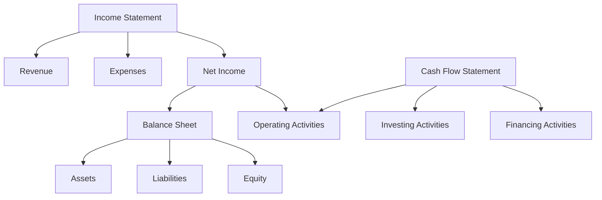

## 9.9 Reading Between the Lines

In the world of financial analysis, the ability to read between the lines of financial statements is a crucial skill that distinguishes proficient analysts from novices. This section will guide you through the process of uncovering hidden issues or opportunities within financial statements, providing you with the tools necessary to make informed investment decisions. By delving deeper into the financial statements, you can gain insights that are not immediately apparent, allowing you to assess a company's true financial health and potential.

### Understanding the Basics

Before diving into the intricacies of reading between the lines, it's essential to have a solid understanding of the basic components of financial statements: the balance sheet, income statement, and cash flow statement. Each of these documents provides a different perspective on a company's financial performance and position.

- **Balance Sheet:** Offers a snapshot of a company's assets, liabilities, and equity at a specific point in time. It reflects the company's financial position and its ability to meet short- and long-term obligations.
- **Income Statement:** Shows the company's revenues, expenses, and profits over a period. It provides insights into the company's operational efficiency and profitability.
- **Cash Flow Statement:** Details the inflows and outflows of cash, highlighting the company's liquidity and financial flexibility.

### Identifying Red Flags

Financial statements can sometimes mask underlying issues that may not be immediately visible. Here are some red flags to watch out for:

1. **Inconsistent Revenue Recognition:** Look for unusual spikes or declines in revenue that do not align with industry trends or company announcements. This could indicate aggressive or conservative revenue recognition practices.

2. **Rising Debt Levels:** A significant increase in debt without a corresponding increase in revenue or assets may signal potential liquidity issues.

3. **Declining Margins:** A consistent decline in gross or operating margins may suggest increasing costs or pricing pressures that could affect profitability.

4. **Frequent Changes in Accounting Policies:** Changes in accounting methods can sometimes be used to manipulate financial results. Be wary of frequent changes without clear justification.

5. **Unusual Items and Non-Recurring Charges:** Companies may use one-time charges to obscure ongoing operational issues. Analyze these items to determine their true impact on financial performance.

### Exploring Hidden Opportunities

While red flags are crucial to identify, financial statements can also reveal hidden opportunities:

1. **Undervalued Assets:** Look for assets that may be undervalued on the balance sheet, such as real estate or intellectual property, which could provide future upside potential.

2. **Strong Cash Flow Generation:** Companies with robust cash flow generation capabilities may have the flexibility to invest in growth opportunities or return capital to shareholders.

3. **Operational Efficiency Improvements:** Identify companies that have successfully reduced costs or improved operational efficiency, as these improvements can lead to enhanced profitability.

4. **Market Expansion Potential:** Analyze the geographic and product diversification of a company to assess its potential for market expansion and revenue growth.

### Case Study: Analyzing Financial Statements

Let's consider a hypothetical case study to illustrate the process of reading between the lines. Imagine you are analyzing the financial statements of a Canadian manufacturing company, MapleTech Inc.

#### Step 1: Review the Income Statement

- **Revenue Growth:** MapleTech's revenue has grown steadily over the past three years, but a closer look reveals that the growth is primarily driven by price increases rather than volume growth. This could indicate potential pricing pressures in the future.
  
- **Operating Expenses:** The company's operating expenses have increased at a slower rate than revenue, suggesting improved operational efficiency. However, the increase in marketing expenses may warrant further investigation to ensure it is driving sustainable growth.

#### Step 2: Examine the Balance Sheet

- **Asset Composition:** MapleTech's balance sheet shows a significant increase in intangible assets, primarily due to recent acquisitions. It's important to assess the quality and potential return on these assets.

- **Liabilities:** The company has taken on additional debt to finance its acquisitions. While the debt levels are within industry norms, monitoring the company's ability to service this debt is crucial.

#### Step 3: Analyze the Cash Flow Statement

- **Operating Cash Flow:** MapleTech's operating cash flow has remained strong, indicating effective cash management. However, the company has also increased its capital expenditures, which could impact future cash flow if not managed carefully.

- **Financing Activities:** The company has been actively repurchasing shares, which could be a positive sign of management's confidence in the company's future prospects.

### Practical Examples and Scenarios

To further enhance your understanding, consider the following practical examples and scenarios:

1. **Scenario: A Retail Company's Inventory Management**

   - **Observation:** The company's inventory turnover ratio has declined over the past year.
   - **Analysis:** This could indicate potential issues with inventory management, such as overstocking or slow-moving products. Investigating the reasons behind the decline can help assess the company's operational efficiency.

2. **Scenario: A Technology Firm's R&D Spending**

   - **Observation:** The firm has significantly increased its R&D spending.
   - **Analysis:** While increased R&D spending can signal innovation and future growth potential, it's essential to evaluate whether the spending is translating into new product development and revenue growth.

### Real-World Applications and Regulatory Scenarios

In the Canadian context, understanding the regulatory environment is crucial for accurate financial analysis. Familiarize yourself with the International Financial Reporting Standards (IFRS) as adopted in Canada, as well as the Accounting Standards for Private Enterprises (ASPE). These standards provide guidelines for financial reporting and ensure consistency and transparency.

#### Example: IFRS 15 - Revenue from Contracts with Customers

- **Application:** IFRS 15 outlines the principles for recognizing revenue from contracts with customers. Understanding these principles can help you assess whether a company is recognizing revenue appropriately and consistently.

### Step-by-Step Guidance for Financial Analysis

1. **Gather Information:** Collect the company's financial statements, including the balance sheet, income statement, and cash flow statement.

2. **Perform Ratio Analysis:** Calculate key financial ratios, such as liquidity ratios, profitability ratios, and solvency ratios, to assess the company's financial health.

3. **Conduct Trend Analysis:** Analyze trends in financial performance over multiple periods to identify patterns and potential issues.

4. **Compare with Industry Benchmarks:** Compare the company's financial performance with industry benchmarks to assess its competitive position.

5. **Evaluate Management's Discussion and Analysis (MD&A):** Review the MD&A section of the annual report for insights into management's perspective on the company's performance and future prospects.

### Diagrams and Visuals

To enhance your understanding, let's use a Mermaid.js diagram to illustrate the relationship between the three primary financial statements:

### Best Practices and Common Pitfalls

- **Best Practice:** Regularly update your financial analysis with the latest financial statements and industry data to ensure accuracy and relevance.
- **Common Pitfall:** Relying solely on financial ratios without considering qualitative factors, such as management quality and industry dynamics, can lead to incomplete analysis.

### References and Additional Resources

- **CPA Canada:** Visit the CPA Canada website for resources on financial reporting standards and best practices.
- **IFRS Foundation:** Explore the IFRS Foundation website for detailed information on IFRS standards and updates.
- **Financial Analysis Textbooks:** Consider textbooks such as "Financial Statement Analysis" by Martin S. Fridson and Fernando Alvarez for in-depth insights.

### Summary

Reading between the lines of financial statements is an essential skill for any aspiring accountant or financial analyst. By identifying hidden issues and opportunities, you can make informed investment decisions and contribute to the financial success of your organization. Remember to consider both quantitative and qualitative factors in your analysis, and stay informed about the latest developments in financial reporting standards.

## **Ready to Test Your Knowledge?**



### Which financial statement provides a snapshot of a company's financial position at a specific point in time?

- [x] Balance Sheet
- [ ] Income Statement
- [ ] Cash Flow Statement
- [ ] Statement of Changes in Equity

> **Explanation:** The balance sheet provides a snapshot of a company's assets, liabilities, and equity at a specific point in time.

### What might a consistent decline in gross or operating margins indicate?

- [x] Increasing costs or pricing pressures
- [ ] Improved operational efficiency
- [ ] Strong cash flow generation
- [ ] Undervalued assets

> **Explanation:** A consistent decline in gross or operating margins may suggest increasing costs or pricing pressures that could affect profitability.

### What is a potential red flag if a company frequently changes its accounting policies?

- [x] Manipulation of financial results
- [ ] Improved financial transparency
- [ ] Enhanced operational efficiency
- [ ] Increased revenue growth

> **Explanation:** Frequent changes in accounting policies can sometimes be used to manipulate financial results, which is a potential red flag.

### What does a significant increase in intangible assets on the balance sheet typically indicate?

- [x] Recent acquisitions
- [ ] Improved cash flow
- [ ] Declining margins
- [ ] Increased debt levels

> **Explanation:** A significant increase in intangible assets is often due to recent acquisitions, which should be assessed for quality and potential return.

### Which financial ratio would you calculate to assess a company's liquidity?

- [x] Current Ratio
- [ ] Debt to Equity Ratio
- [x] Quick Ratio
- [ ] Gross Profit Margin

> **Explanation:** The current ratio and quick ratio are liquidity ratios used to assess a company's ability to meet short-term obligations.

### What is the primary purpose of the cash flow statement?

- [x] To detail the inflows and outflows of cash
- [ ] To show the company's revenues and expenses
- [ ] To provide a snapshot of the company's financial position
- [ ] To outline changes in equity

> **Explanation:** The cash flow statement details the inflows and outflows of cash, highlighting the company's liquidity and financial flexibility.

### What could a decline in a retail company's inventory turnover ratio indicate?

- [x] Potential issues with inventory management
- [ ] Improved operational efficiency
- [x] Overstocking or slow-moving products
- [ ] Increased revenue growth

> **Explanation:** A decline in inventory turnover ratio could indicate potential issues with inventory management, such as overstocking or slow-moving products.

### What should you assess when a technology firm significantly increases its R&D spending?

- [x] Whether the spending translates into new product development and revenue growth
- [ ] The firm's liquidity ratios
- [ ] The firm's debt levels
- [ ] The firm's gross profit margin

> **Explanation:** When a technology firm increases its R&D spending, it's essential to evaluate whether the spending is translating into new product development and revenue growth.

### What is the role of IFRS 15 in financial reporting?

- [x] To outline principles for recognizing revenue from contracts with customers
- [ ] To detail the inflows and outflows of cash
- [ ] To provide guidelines for asset valuation
- [ ] To set standards for financial statement presentation

> **Explanation:** IFRS 15 outlines the principles for recognizing revenue from contracts with customers, ensuring consistency and transparency in financial reporting.

### True or False: Reading between the lines of financial statements involves considering both quantitative and qualitative factors.

- [x] True
- [ ] False

> **Explanation:** Reading between the lines involves considering both quantitative and qualitative factors to gain a comprehensive understanding of a company's financial health.


